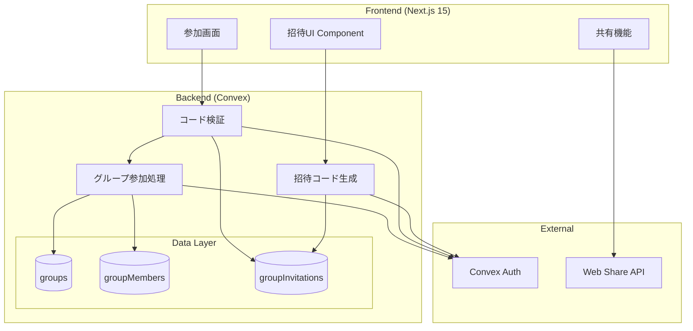
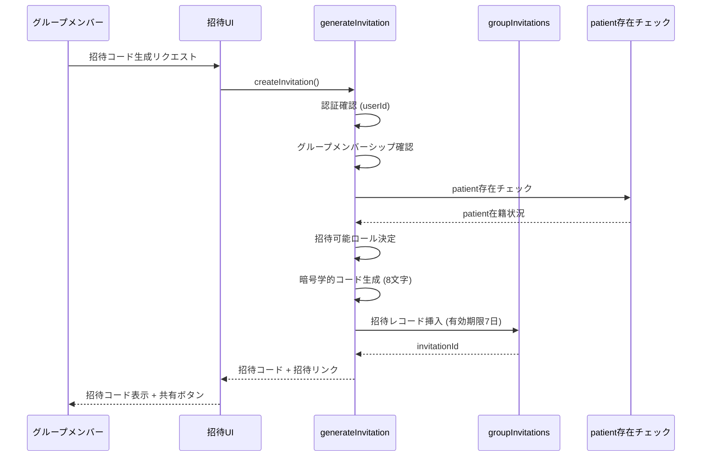
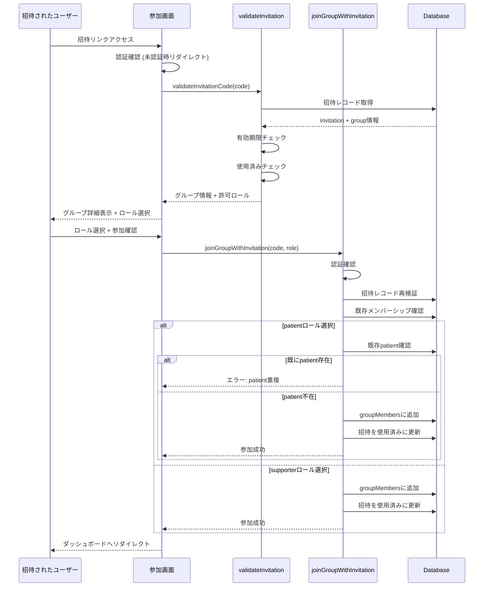
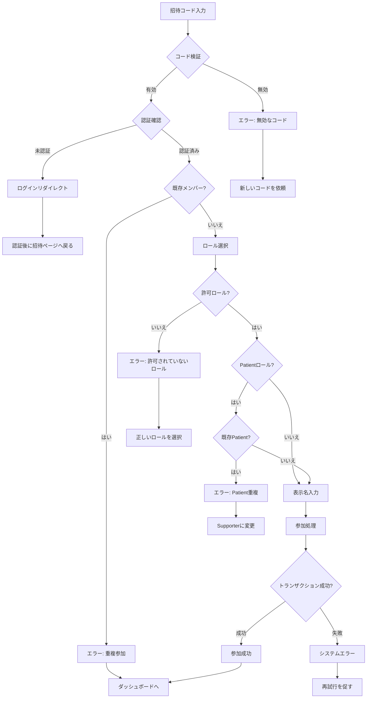
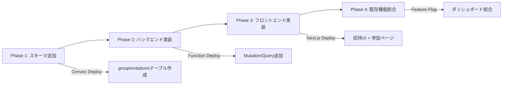

# 技術設計書: グループ参加・招待機能

## Overview

この機能は、おくすりサポートアプリにおいて、既存グループへの安全かつ簡単な参加メカニズムを提供します。家族や介護者が招待コードまたは招待リンクを使用してグループに参加し、服薬管理を協働で行えるようにします。

**ユーザー**: グループメンバー（患者・サポーター）が招待を作成し、招待を受けた新規ユーザーがグループに参加します。モバイル環境での利便性を重視し、LINEやメールで簡単に共有できる招待リンク機能を提供します。

**既存システムへの影響**: 現在のグループ管理機能（`convex/groups.ts`）を拡張し、新しい招待テーブル（`groupInvitations`）をスキーマに追加します。既存の`joinGroup` mutationは招待コード検証機能を組み込む形で更新されます。

### Goals
- 招待コード生成と管理機能の実装（有効期限7日間、暗号学的に安全なコード）
- 招待リンクのモバイル共有対応（Web Share API統合）
- 1グループ1患者制約の厳密な適用
- 既存グループ機能との後方互換性維持

### Non-Goals
- メールアドレスベースの直接招待（Phase 2で検討）
- 招待の承認フロー（初期フェーズは自動承認）
- グループメンバーの削除・退出機能（別機能として実装）
- 招待コードの使用回数制限（初期は単一使用のみ）

## Architecture

### 既存アーキテクチャの分析

**現在のグループ管理パターン**:
- `convex/groups.ts`: グループCRUD操作とメンバーシップ管理
- `convex/schema.ts`: `groups`テーブルと`groupMembers`テーブル
- Convex Auth (`@convex-dev/auth/server`): `getAuthUserId()`による認証
- App Router: `/src/app/onboarding/`, `/src/app/dashboard/`でのグループ作成UI

**維持すべきドメイン境界**:
- グループ所有権: `createdBy`フィールドによる作成者追跡
- メンバーシップ管理: `groupMembers`テーブルの構造とインデックス
- ロールベース権限: `patient`/`supporter`の2ロール体系

**統合ポイント**:
- 既存の`joinGroup` mutation: 招待コード検証ロジックを追加
- `getUserGroupStatus` query: 招待状態の表示に活用
- `getGroupMembers` query: patient存在チェックに使用

### 高レベルアーキテクチャ



### 技術スタックとの整合性

**既存技術スタックとの整合**:
- Convex mutation/query パターンに従った新規関数の追加
- TypeScript strict mode準拠の型定義
- Next.js App Router での新規ページルート（`/invite/[code]`）
- Tailwind CSS + Radix UIによる一貫したUIコンポーネント

**新規追加ライブラリ**:
なし。既存の技術スタックのみで実装可能。

**アーキテクチャ原則の適用**:
- Server/Client Component分離: 招待リンク表示はClient Component、コード検証はServer Component
- Type Safety First: 招待コードインターフェースの明示的型定義
- Real-time by Default: Convex Reactive Queriesによる招待一覧のリアルタイム更新
- Security Layers: バックエンドでの全招待操作の認証・認可チェック

## System Flows

### 招待コード生成フロー



### グループ参加フロー



## Requirements Traceability

| 要件 | 要件概要 | コンポーネント | インターフェース | フロー |
|------|----------|---------------|----------------|--------|
| 1.1 | 招待コード生成 | InvitationService | createInvitation mutation | 招待コード生成フロー |
| 1.2 | patient不在時のロール許可 | InvitationService | createInvitation mutation | 招待コード生成フロー (patient存在チェック) |
| 1.3 | patient存在時のsupporter制限 | InvitationService | createInvitation mutation | 招待コード生成フロー (patient存在チェック) |
| 1.4 | 有効期限設定 (7日間) | InvitationService | createInvitation mutation | - |
| 1.5 | 有効期限切れ無効化 | ValidationService | validateInvitationCode query | グループ参加フロー (有効期限チェック) |
| 1.6 | 招待コード一覧表示 | InvitationList Component | listGroupInvitations query | - |
| 2.1 | 招待コード検証とグループ情報表示 | ValidationService | validateInvitationCode query | グループ参加フロー |
| 2.2 | 重複参加防止 | JoinService | joinGroupWithInvitation mutation | グループ参加フロー (既存メンバーシップ確認) |
| 2.3 | ロール選択と参加処理 | JoinService | joinGroupWithInvitation mutation | グループ参加フロー |
| 2.4 | patient重複制約 | JoinService | joinGroupWithInvitation mutation | グループ参加フロー (既存patient確認) |
| 2.5 | 参加日時と表示名記録 | JoinService | joinGroupWithInvitation mutation | - |
| 2.6 | 無効コードエラー | ValidationService | validateInvitationCode query | グループ参加フロー |
| 3.1-3.5 | 招待リンク共有 | InvitationShare Component | - | - |
| 4.1-4.3 | 招待権限管理 | InvitationService | createInvitation mutation | 招待コード生成フロー (認証・メンバーシップ確認) |
| 5.1-5.4 | グループ参加状態管理 | Dashboard Components | 既存 getUserGroupStatus query | - |
| 6.1-6.5 | データ整合性とセキュリティ | 全コンポーネント | 全mutation/query | 全フロー |

## Components and Interfaces

### Backend Layer (Convex)

#### InvitationService (`convex/invitations.ts`)

**責任と境界**
- **主要責任**: 招待コードのライフサイクル管理（生成、検証、無効化）
- **ドメイン境界**: グループ招待ドメイン（グループ管理ドメインと協調）
- **データ所有権**: `groupInvitations`テーブルの全レコード
- **トランザクション境界**: 招待生成は単一トランザクション、招待使用はグループ参加と結合

**依存関係**
- **Inbound**: 招待UI Component、参加画面Component
- **Outbound**: `groupMembers`テーブル（patient存在チェック）、`groups`テーブル（グループ情報取得）
- **External**: Convex Auth（`getAuthUserId`）、Node.js crypto module（コード生成）

**契約定義**

```typescript
// Mutation: 招待コード生成
export const createInvitation = mutation({
  args: {
    groupId: v.id("groups"),
  },
  returns: v.object({
    invitationId: v.id("groupInvitations"),
    code: v.string(),
    expiresAt: v.number(),
    allowedRoles: v.array(v.union(v.literal("patient"), v.literal("supporter"))),
  }),
});

// Query: 招待コード検証
export const validateInvitationCode = query({
  args: {
    code: v.string(),
  },
  returns: v.union(
    v.object({
      valid: v.literal(true),
      invitation: v.object({
        groupId: v.id("groups"),
        groupName: v.string(),
        groupDescription: v.optional(v.string()),
        allowedRoles: v.array(v.union(v.literal("patient"), v.literal("supporter"))),
        expiresAt: v.number(),
      }),
    }),
    v.object({
      valid: v.literal(false),
      error: v.string(),
    }),
  ),
});

// Query: グループの招待一覧取得
export const listGroupInvitations = query({
  args: {
    groupId: v.id("groups"),
  },
  returns: v.array(v.object({
    _id: v.id("groupInvitations"),
    code: v.string(),
    createdBy: v.string(),
    createdAt: v.number(),
    expiresAt: v.number(),
    allowedRoles: v.array(v.union(v.literal("patient"), v.literal("supporter"))),
    isUsed: v.boolean(),
    usedBy: v.optional(v.string()),
    usedAt: v.optional(v.number()),
  })),
});
```

**事前条件**:
- `createInvitation`: ユーザーは認証済みで、指定されたグループのメンバーである
- `validateInvitationCode`: コードは8文字の英数字文字列
- `listGroupInvitations`: ユーザーは認証済みで、指定されたグループのメンバーである

**事後条件**:
- `createInvitation`: 一意な招待コードが生成され、7日後の有効期限が設定される
- `validateInvitationCode`: コードの有効性が返され、有効な場合はグループ情報を含む
- `listGroupInvitations`: グループの全招待（有効・無効含む）が返される

**不変条件**:
- 招待コードは常に一意である
- 有効期限は常に未来の日時である（生成時）
- 使用済み招待は再利用不可

#### JoinService (`convex/groups.ts` - 既存ファイル拡張)

**責任と境界**
- **主要責任**: 招待コードを使用したグループ参加処理とpatient単一性制約の適用
- **ドメイン境界**: グループメンバーシップ管理
- **データ所有権**: `groupMembers`テーブルの新規レコード
- **トランザクション境界**: 招待検証、メンバーシップ作成、招待無効化を単一トランザクションで実行

**依存関係**
- **Inbound**: 参加画面Component
- **Outbound**: `groupInvitations`テーブル（検証・更新）、`groupMembers`テーブル（重複・patient確認）
- **External**: Convex Auth（`getAuthUserId`）

**契約定義**

```typescript
// Mutation: 招待コードを使用したグループ参加
export const joinGroupWithInvitation = mutation({
  args: {
    invitationCode: v.string(),
    role: v.union(v.literal("patient"), v.literal("supporter")),
    displayName: v.string(),
  },
  returns: v.object({
    success: v.boolean(),
    groupId: v.id("groups"),
    membershipId: v.id("groupMembers"),
  }),
});
```

**事前条件**:
- ユーザーは認証済み
- 招待コードは有効で未使用
- ユーザーはグループの既存メンバーではない
- 選択したロールは招待の許可ロールに含まれる
- patientロール選択時、グループに既存patientが存在しない

**事後条件**:
- ユーザーがグループメンバーとして追加される
- 招待が使用済みとしてマークされる（`isUsed: true`, `usedBy`, `usedAt`）
- patient制約が維持される（1グループ1patient）

**不変条件**:
- 各グループにpatientは最大1人
- 使用済み招待は再利用不可
- メンバーシップは一意（userId + groupIdの組み合わせ）

**統合戦略**:
- **修正アプローチ**: 既存の`joinGroup` mutationを拡張せず、新規`joinGroupWithInvitation` mutationを追加
- **後方互換性**: 既存の直接参加フロー（グループID指定）は維持
- **移行パス**: 段階的に招待ベース参加へ移行、将来的に直接参加を非推奨化

### Frontend Layer (Next.js)

#### InvitationManagement Component (`src/components/invitation/InvitationManagement.tsx`)

**責任と境界**
- **主要責任**: 招待コードの生成、一覧表示、共有機能の提供
- **ドメイン境界**: 招待管理UI
- **データ所有権**: なし（バックエンドからのデータ表示のみ）

**依存関係**
- **Inbound**: ダッシュボードまたはグループ設定画面
- **Outbound**: `createInvitation` mutation、`listGroupInvitations` query
- **External**: Web Share API（モバイル共有）、Clipboard API（コピー機能）

**契約定義**

```typescript
interface InvitationManagementProps {
  groupId: Id<"groups">;
}

interface InvitationDisplay {
  code: string;
  expiresAt: number;
  allowedRoles: ("patient" | "supporter")[];
  isUsed: boolean;
  createdAt: number;
}
```

**UIフロー**:
1. グループの既存招待一覧を表示（有効期限、許可ロール、使用状態）
2. 「招待コードを生成」ボタンクリック → `createInvitation` mutation実行
3. 生成された招待コードと招待リンクを表示
4. 共有ボタン（Web Share API使用）またはコピーボタン（Clipboard API使用）を提供

#### InvitationJoin Page (`src/app/invite/[code]/page.tsx`)

**責任と境界**
- **主要責任**: 招待リンクからのグループ参加フロー
- **ドメイン境界**: 参加UI
- **データ所有権**: なし

**依存関係**
- **Inbound**: 招待リンク（外部共有）
- **Outbound**: `validateInvitationCode` query、`joinGroupWithInvitation` mutation
- **External**: Next.js App Router（認証リダイレクト）、Convex Auth（認証状態確認）

**契約定義**

```typescript
interface InvitationJoinPageProps {
  params: {
    code: string;
  };
}

interface JoinFormData {
  role: "patient" | "supporter";
  displayName: string;
}
```

**UIフロー**:
1. URLパラメータから招待コードを取得
2. 認証確認（未認証時は`/login?redirect=/invite/[code]`へリダイレクト）
3. `validateInvitationCode` queryでコード検証とグループ情報取得
4. グループ詳細表示（グループ名、説明、現在のメンバー数）
5. ロール選択フォーム表示（許可ロールのみ選択可能）
6. 表示名入力フォーム
7. 参加確認 → `joinGroupWithInvitation` mutation実行
8. 成功時は`/dashboard`へリダイレクト、エラー時はエラーメッセージ表示

## Data Models

### Physical Data Model (Convex Schema)

#### groupInvitations テーブル

```typescript
groupInvitations: defineTable({
  code: v.string(),              // 招待コード（8文字英数字、一意）
  groupId: v.id("groups"),       // 対象グループ
  createdBy: v.string(),         // 作成者のuserId
  createdAt: v.number(),         // 作成日時（timestamp）
  expiresAt: v.number(),         // 有効期限（timestamp、createdAt + 7日）
  allowedRoles: v.array(         // 招待可能ロール
    v.union(
      v.literal("patient"),
      v.literal("supporter")
    )
  ),
  isUsed: v.boolean(),           // 使用済みフラグ
  usedBy: v.optional(v.string()),// 使用者のuserId
  usedAt: v.optional(v.number()),// 使用日時（timestamp）
})
  .index("by_code", ["code"])                    // コード検索用（一意制約）
  .index("by_groupId", ["groupId"])              // グループ別招待一覧
  .index("by_groupId_isUsed", ["groupId", "isUsed"]) // 有効招待フィルタリング
```

**インデックス設計の根拠**:
- `by_code`: 招待コード検証時の高速検索（O(log n)）
- `by_groupId`: グループの招待一覧取得
- `by_groupId_isUsed`: 有効な招待のみのフィルタリング（将来の再利用可能招待対応）

**データ整合性ルール**:
- `code`は一意（招待コード生成時に重複チェック）
- `expiresAt` > `createdAt`（常に7日後）
- `isUsed == true` → `usedBy`と`usedAt`は必須
- `isUsed == false` → `usedBy`と`usedAt`は未設定

#### groupMembers テーブル（既存）

既存のスキーマを維持。新規フィールド追加なし。

**patient単一性制約の適用**:
- グループ参加時に`groupMembers`テーブルを`by_groupId`インデックスでクエリ
- `role == "patient"`のレコードが存在するか確認
- 存在する場合、patientロールでの参加をトランザクション内で拒否

### Data Contracts & Integration

#### 招待コード生成契約

**リクエスト**:
```typescript
{
  groupId: Id<"groups">
}
```

**レスポンス**:
```typescript
{
  invitationId: Id<"groupInvitations">,
  code: string,              // 8文字英数字
  expiresAt: number,         // timestamp (now + 7日)
  allowedRoles: ("patient" | "supporter")[]
}
```

**ビジネスロジック**:
1. グループのメンバーシップ確認
2. patient存在チェック → `allowedRoles`決定
   - patient不在: `["patient", "supporter"]`
   - patient存在: `["supporter"]`
3. 暗号学的に安全なコード生成（`crypto.randomBytes`使用）
4. 有効期限設定（`Date.now() + 7 * 24 * 60 * 60 * 1000`）

#### グループ参加契約

**リクエスト**:
```typescript
{
  invitationCode: string,
  role: "patient" | "supporter",
  displayName: string
}
```

**レスポンス（成功時）**:
```typescript
{
  success: true,
  groupId: Id<"groups">,
  membershipId: Id<"groupMembers">
}
```

**レスポンス（エラー時）**:
```typescript
{
  success: false,
  error: "招待コードが無効です" | "既にグループに参加しています" | "このグループには既に患者が登録されています"
}
```

**トランザクション処理**:
1. 招待コード検証（有効期限、未使用）
2. 既存メンバーシップ確認（重複防止）
3. patientロール時の既存patient確認
4. `groupMembers`にレコード挿入
5. `groupInvitations`の`isUsed`フラグ更新
6. 全て成功時のみコミット

## Error Handling

### エラー戦略

招待機能では、セキュリティとユーザビリティのバランスを重視したエラーハンドリングを実装します。セキュリティリスクのあるエラー（招待コード不正使用）は詳細を隠蔽し、ユーザー操作ミス（重複参加）は明確なガイダンスを提供します。

### エラーカテゴリと対応

#### ユーザーエラー (4xx相当)

| エラー | 発生条件 | UI表示 | ユーザーアクション |
|--------|---------|--------|-------------------|
| 無効な招待コード | コードが存在しない、期限切れ、使用済み | 「招待コードが無効です。招待を送った方に新しいコードを依頼してください。」 | 新しいコードを入力、または招待元に連絡 |
| 重複参加 | ユーザーが既にグループメンバー | 「既にこのグループのメンバーです。ダッシュボードに戻ります。」 | ダッシュボードへ自動リダイレクト |
| Patient重複 | Patientロール選択時に既存patient存在 | 「このグループには既に患者が登録されています。サポーターとして参加してください。」 | ロール選択をsupporterに変更 |
| 許可されていないロール | 招待の`allowedRoles`に含まれないロール選択 | 「この招待では[許可ロール]として参加できます。」 | 許可されたロールを選択 |
| 未認証 | 認証前に招待リンクアクセス | ログイン画面へリダイレクト（`redirect=/invite/[code]`パラメータ付き） | ログイン後に自動的に招待ページへ戻る |
| 表示名未入力 | 表示名が空文字または50文字超過 | 「表示名を1〜50文字で入力してください。」 | フォームバリデーション、フィールドハイライト |

#### システムエラー (5xx相当)

| エラー | 発生条件 | UI表示 | リカバリー戦略 |
|--------|---------|--------|---------------|
| Convexタイムアウト | mutation実行時のタイムアウト | 「一時的なエラーが発生しました。もう一度お試しください。」 | 自動リトライ（最大3回、指数バックオフ） |
| トランザクション競合 | 同時参加時のpatient重複 | 「処理中にエラーが発生しました。もう一度お試しください。」 | ユーザーに再試行を促す |
| データベースエラー | スキーマ不整合、インデックス破損 | 「システムエラーが発生しました。しばらく待ってから再度お試しください。」 | エラーログ記録、管理者通知 |

#### ビジネスロジックエラー (422相当)

| エラー | 発生条件 | UI表示 | 対応 |
|--------|---------|--------|------|
| グループメンバーでない招待作成 | 非メンバーが招待生成試行 | 「このグループのメンバーではありません。」 | アクセス制限、ダッシュボードへリダイレクト |
| コード生成衝突 | 極めて稀な8文字コード重複 | （内部処理）再生成を3回試行 | 透過的に再生成、失敗時はシステムエラー |

### エラーフロー可視化



### モニタリング

**エラートラッキング**:
- Convex Dashboard でのエラーログ自動記録
- 招待コード検証失敗率の監視（不正使用検出）
- Patient重複エラーの頻度監視（UI/UX改善指標）

**ロギング項目**:
```typescript
{
  level: "error" | "warn" | "info",
  context: "invitation_generation" | "invitation_validation" | "group_join",
  userId: string,
  groupId: Id<"groups">,
  invitationCode: string (ハッシュ化),
  errorType: string,
  errorMessage: string,
  timestamp: number
}
```

**ヘルスモニタリング**:
- 招待コード生成成功率 (目標: 99.9%)
- グループ参加成功率 (目標: 95%以上)
- 平均招待から参加までの時間

## Testing Strategy

### Unit Tests

1. **招待コード生成ロジック** (`createInvitation` mutation)
   - patient不在時に`["patient", "supporter"]`を許可
   - patient存在時に`["supporter"]`のみ許可
   - 8文字英数字コードの一意性確保
   - 有効期限が正確に7日後に設定される

2. **招待コード検証ロジック** (`validateInvitationCode` query)
   - 有効期限切れコードを`valid: false`と判定
   - 使用済みコードを`valid: false`と判定
   - 存在しないコードを`valid: false`と判定
   - 有効なコードでグループ情報を返す

3. **Patient単一性制約** (`joinGroupWithInvitation` mutation)
   - 既存patient存在時、patientロール参加を拒否
   - patient不在時、patientロール参加を許可
   - supporterロールは常に許可

4. **暗号学的コード生成** (ユーティリティ関数)
   - `crypto.randomBytes`を使用
   - 8文字の英数字文字列を生成
   - 統計的に十分な一意性（衝突確率 < 0.01%）

5. **重複参加防止** (`joinGroupWithInvitation` mutation)
   - 既存メンバーの参加をトランザクション内で拒否
   - エラーメッセージ「既にグループに参加しています」を返す

### Integration Tests

1. **招待コード生成から参加までのフロー**
   - グループメンバーAが招待コード生成
   - ユーザーBが招待コードで参加
   - グループメンバー一覧にユーザーBが追加される
   - 招待が使用済みとしてマークされる

2. **Patient制約の統合検証**
   - Patientが存在するグループで招待生成
   - 許可ロールが`["supporter"]`のみであることを確認
   - Patientロール選択時にエラーが返される
   - Supporterロール選択時に参加成功

3. **有効期限切れ招待の処理**
   - 8日前に生成された招待コードで参加試行
   - 検証時に`valid: false`が返される
   - 参加が拒否される

4. **並行招待使用の競合処理**
   - 同一招待コードを2人が同時に使用
   - 1人目は成功、2人目は「使用済み」エラー
   - データベース整合性が維持される

5. **未認証ユーザーのリダイレクト**
   - 未認証で`/invite/[code]`アクセス
   - `/login?redirect=/invite/[code]`へリダイレクト
   - 認証後、元の招待ページへ戻る

### E2E Tests

1. **招待リンク共有からグループ参加まで**
   - グループメンバーが招待コード生成
   - 招待リンクをクリップボードにコピー
   - 新規ユーザーがリンクからアクセス
   - ロール選択と表示名入力
   - 参加成功、ダッシュボードに新グループ表示

2. **Patient制約UI表示**
   - Patient存在グループで招待生成
   - 招待ページでPatientロール選択肢が無効化
   - Supporterのみ選択可能
   - 参加後、グループメンバー一覧でPatientバッジ表示

3. **モバイル共有機能**
   - モバイルブラウザで招待コード生成
   - Web Share APIボタンクリック
   - ネイティブ共有ダイアログ表示
   - LINEアプリで共有

4. **エラーハンドリングUI**
   - 無効な招待コードで参加試行
   - エラーメッセージとリトライガイダンス表示
   - 既存メンバーが再度招待コード使用
   - 重複エラーとダッシュボードリダイレクト

5. **招待一覧のリアルタイム更新**
   - 招待一覧画面を開く
   - 別タブで新規招待コード生成
   - 一覧に即座に反映される（Convex Reactive Query）

### Performance Tests

1. **招待コード生成のレイテンシ**
   - 目標: 500ms以下
   - Patient存在チェッククエリの最適化

2. **大量招待の一覧表示**
   - 100件の招待が存在するグループ
   - 一覧表示が2秒以内に完了
   - ページネーションまたは無限スクロール実装

3. **並行参加処理**
   - 10人が同時に異なる招待コードで参加
   - 全てトランザクションが成功
   - データベースロック競合なし

## Security Considerations

### 脅威モデリング

| 脅威 | リスクレベル | 対策 |
|------|-------------|------|
| 招待コードの総当たり攻撃 | 中 | 8文字英数字（62^8 = 218兆通り）、有効期限7日、レートリミット（将来実装） |
| 招待リンクの盗聴 | 低 | HTTPS強制、コードの使い捨て設計 |
| 不正なPatient登録 | 高 | トランザクション内での既存Patient確認、楽観的ロックによる競合検出 |
| 招待の再利用 | 中 | `isUsed`フラグと`usedBy`/`usedAt`の原子的更新 |
| グループデータの不正アクセス | 高 | 全mutation/queryでの認証・認可チェック、グループメンバーシップ検証 |

### セキュリティコントロール

**認証レイヤー**:
- Convex Auth (`getAuthUserId()`) による全API呼び出しの認証
- 未認証ユーザーの招待ページアクセス時の自動リダイレクト

**認可レイヤー**:
- 招待生成: グループメンバーシップ確認（`groupMembers`テーブルクエリ）
- 招待一覧: グループメンバーシップ確認
- グループ参加: 招待コードの有効性とロール許可確認

**データ保護**:
- 招待コードの暗号学的生成（`crypto.randomBytes`、Node.js標準ライブラリ）
- ログ記録時の招待コードハッシュ化（元のコードは記録しない）
- ユーザーIDの文字列型保存（Convex Authに準拠）

**トランザクション整合性**:
- Patient単一性制約のトランザクション内検証
- 招待使用フラグの原子的更新（Check-then-act競合の防止）

### コンプライアンス

**個人情報保護**:
- 招待コードには個人情報を含めない（ランダム文字列のみ）
- ユーザー表示名は暗号化せず保存（グループ内共有が前提）

**監査証跡**:
- 招待作成者（`createdBy`）と使用者（`usedBy`）の記録
- タイムスタンプによる操作履歴の追跡

## Migration Strategy

既存システムへの影響が限定的なため、段階的デプロイにより安全に導入します。



### Phase 1: スキーマ追加（影響範囲: なし）
- `convex/schema.ts`に`groupInvitations`テーブル定義を追加
- Convex Deploy実行（既存データに影響なし）
- 検証: Convex Dashboardでテーブル作成確認

### Phase 2: バックエンド実装（影響範囲: なし）
- `convex/invitations.ts`新規作成、mutation/query実装
- 既存`convex/groups.ts`に`joinGroupWithInvitation` mutation追加
- デプロイ後、Convex Dashboard から手動テスト
- 検証: 招待コード生成、検証、参加処理の単体テスト

### Phase 3: フロントエンド実装（影響範囲: 新規ページのみ）
- `/src/app/invite/[code]/page.tsx`新規作成
- `/src/components/invitation/`コンポーネント実装
- デプロイ（既存ページに影響なし）
- 検証: `/invite/test-code`ページアクセス、UI表示確認

### Phase 4: 既存機能統合（影響範囲: ダッシュボードのみ）
- ダッシュボードに「招待」ボタン追加
- グループメンバー画面に招待一覧表示
- Feature Flagによる段階的ロールアウト（環境変数`ENABLE_INVITATION_FEATURE`）
- 検証: 既存グループ作成・参加フローが正常動作

### ロールバック戦略

| フェーズ | ロールバック手順 | データ整合性 |
|---------|----------------|-------------|
| Phase 1 | スキーマ削除（データが空の場合のみ） | 影響なし |
| Phase 2 | Convex関数削除（フロントエンドが未使用） | 影響なし |
| Phase 3 | Next.jsデプロイ前バージョンに戻す | 影響なし（招待データは保持） |
| Phase 4 | Feature Flag無効化 | 既存機能は影響なし、招待データは保持 |

### 検証チェックポイント

**Phase 1完了時**:
- [ ] `groupInvitations`テーブルがConvex Dashboardに表示される
- [ ] インデックス（`by_code`、`by_groupId`、`by_groupId_isUsed`）が作成されている

**Phase 2完了時**:
- [ ] `createInvitation` mutationが招待コードを生成する
- [ ] `validateInvitationCode` queryが有効/無効を正しく判定する
- [ ] `joinGroupWithInvitation` mutationがpatient制約を適用する

**Phase 3完了時**:
- [ ] `/invite/[code]`ページがレンダリングされる
- [ ] 招待コード検証APIが呼ばれる
- [ ] ロール選択UIが許可ロールに応じて表示される

**Phase 4完了時**:
- [ ] ダッシュボードから招待生成が可能
- [ ] 招待リンク共有が動作する
- [ ] 既存のグループ作成・オンボーディングフローが正常動作
