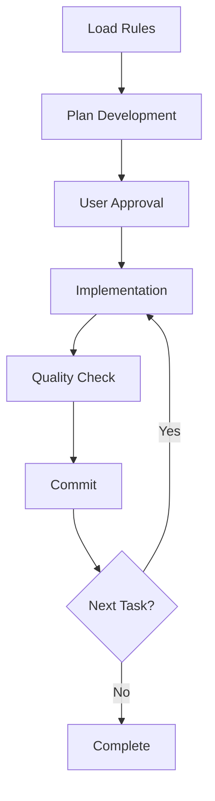

# okusuri-support 💊

*Read this in other languages: [日本語](README.ja.md)*

**Status: Production Ready**

患者本人とサポートする保護者の二人三脚で服薬管理を行うための支援アプリ。まずは記録することを目的として、患者のその意思を肯定的に尊重する。記録が継続的に行えるよう支援し、また保護者は患者の服薬状況を把握し、必要に応じて適切なサポートを行えることを目指します。

## 🎯 Features

- **服薬記録**: 患者の服薬状況を簡単に記録・管理
- **保護者サポート**: 保護者が患者の服薬状況を把握できる
- **意思尊重**: 患者の自律性を重視した設計
- **継続支援**: 長期的な服薬管理をサポート
- **Next.js 15**: 最新のReact 19とNext.js 15を採用
- **TypeScript**: 型安全性を重視した開発

## 📂 Project Structure

```
okusuri-support/
├── .claude/
│   ├── agents-ja/          # subagent definitions (Japanese)
│   ├── agents-en/          # subagent definitions (English)
│   ├── commands-ja/        # Custom slash commands (Japanese)
│   └── commands-en/        # Custom slash commands (English)
├── docs/
│   ├── rules-ja/           # Development rules for Claude Code (Japanese)
│   │   └── rules-index.yaml  # Rule file index with metadata
│   ├── rules-en/           # Development rules for Claude Code (English)
│   │   └── rules-index.yaml  # Rule file index with metadata
│   ├── guides/
│   │   ├── ja/
│   │   │   └── sub-agents.md  # subagents practical guide (Japanese)
│   │   └── en/
│   │       └── sub-agents.md  # subagents practical guide (English)
│   ├── adr/               # Architecture Decision Records
│   ├── design/            # Design documents
│   ├── plans/             # Work plans (excluded from git)
│   └── prd/               # Product Requirements Documents
├── src/                   # Source code directory
│   └── index.ts           # Entry point sample
├── scripts/               # Development support scripts
│   └── set-language.js    # Language switching script
├── CLAUDE.ja.md           # Claude Code configuration (Japanese)
├── CLAUDE.en.md           # Claude Code configuration (English)
├── README.ja.md           # README (Japanese)
├── README.md              # README (English - this file)
├── tsconfig.json          # TypeScript strict configuration
├── biome.json            # Linter & Formatter configuration
└── vitest.config.mjs     # Test configuration
```

## 🌐 Multilingual Support

This boilerplate supports both Japanese and English languages.

### Language Switching Commands

```bash
# Switch to Japanese
npm run lang:ja

# Switch to English
npm run lang:en

# Check current language setting
npm run lang:status
```

When you switch languages, the following files are automatically updated:
- `CLAUDE.md` - Claude Code configuration file
- `docs/rules/` - Development rules directory
- `docs/guides/sub-agents.md` - subagents guide
- `.claude/commands/` - Slash commands
- `.claude/agents/` - subagent definitions

## 🚀 Getting Started

### 1. 環境要件

- **Node.js**: 20.x
- **npm**: 最新版
- **ブラウザ**: Chrome, Firefox, Safari, Edge の最新版

### 2. セットアップ手順

```bash
# リポジトリをクローン
git clone https://github.com/trust-delta/okusuri-support.git
cd okusuri-support

# 依存関係をインストール
npm install

# 開発サーバーを起動
npm run dev
```

### 3. アプリケーションアクセス

- **ローカル環境**: http://localhost:3000
- **Storybook**: http://localhost:6006 (npm run storybook 実行後)

### 4. 初回セットアップチェック

```bash
# ビルドチェック
npm run build

# テスト実行
npm test

# 品質チェック
npm run check:all
```

### 5. 環境設定

```bash
# Git Hooks セットアップ (自動実行されます)
npm run prepare

# 言語設定 (日本語環境)
npm run lang:ja
```


## 🛠️ 技術スタック

### フロントエンド
- **Next.js 15.0**: React フレームワーク
- **React 19.0**: UI ライブラリ
- **TypeScript 5.0**: 型安全な開発
- **Tailwind CSS 4.0**: スタイリング
- **Radix UI**: アクセシブルなコンポーネント

### 開発ツール
- **Vitest**: テストフレームワーク
- **Playwright**: E2E テスト
- **Biome**: リンター・フォーマッター
- **Storybook**: コンポーネント開発
- **Husky + lint-staged**: Git フック

## 📊 品質指標

- **テストカバレッジ**: 82.14%
- **ビルド成功率**: 100%
- **テスト成功率**: 100% (Vitest + Playwright)
- **Bundle サイズ**: 初期 100KB
- **型安全性**: 100% (any型使用禁止)

## 💻 開発コマンド

### 基本コマンド
```bash
npm run dev        # 開発サーバー起動
npm run build      # プロダクションビルド
npm run start      # プロダクションサーバー起動
npm run test       # テスト実行
npm run test:watch # テスト監視モード
```

### 品質チェック
```bash
npm run check:all        # 全体品質チェック
npm run lint             # リント チェック
npm run lint:fix         # リント 自動修正
npm run format           # コード フォーマット
npm run check            # Biome チェック
npm run check:deps       # 循環依存チェック
```

### テスト関連
```bash
npm run test:coverage:fresh  # カバレッジ測定（クリーン）
npm run test:ui             # Vitest UI 起動
npm run test:e2e            # E2E テスト実行
npm run test:e2e:ui         # Playwright UI
npm run cleanup:processes   # テストプロセス クリーンアップ
```

### Storybook
```bash
npm run storybook           # Storybook 開発サーバー
npm run build-storybook     # Storybook ビルド
```

## 🎯 Claude Code Custom Slash Commands

This boilerplate includes 6 custom slash commands to streamline development with Claude Code:

### `/onboard`
Loads project rule files and enforces development conventions.
- Load all rule files
- Understand critical rules (especially "Investigation OK, Implementation STOP")
- Confirm architecture patterns

### `/implement`
Acts as orchestrator managing the complete cycle from requirement analysis to implementation.
- Interactive requirement clarification
- Scale assessment via requirement-analyzer
- Automated progression: design → planning → implementation
- Automatic detection and re-analysis of requirement changes

### `/design`
Executes from requirement analysis to design document creation.
- Deep dive into requirement background and objectives
- Scale-appropriate design document creation (PRD/ADR/Design Doc)
- Present design alternatives and trade-offs

### `/plan`
Creates work plans and task decomposition from design documents.
- Review and select existing design documents
- Create work plans via work-planner
- Task decomposition to commit-level granularity via task-decomposer
- Obtain bulk approval for entire implementation phase

### `/build`
Implements decomposed tasks in autonomous execution mode.
- Review task files
- Automated cycle: task-executor → quality-fixer → commit
- Detect requirement changes or critical errors with appropriate responses
- Post-implementation summary and coverage reporting

### `/task`
Executes tasks following appropriate rules.
- Clarify applicable development rules before execution
- Determine initial actions based on rules
- Identify prohibitions to avoid in the task
- Promote metacognition and prevent implementation errors proactively

### `/review`
Design Doc compliance validation with optional auto-fixes.
- Validate Design Doc compliance rate
- Interactive fix confirmation (y/n)
- Execute metacognition before fixes (rule-advisor → TodoWrite → task-executor → quality-fixer)
- Report improvement metrics after fixes

### `/rule-maintenance`
Add, update, and search development rules.
- Add new rule files with metadata
- Update existing rules
- Search rules by keywords
- Manage rules-index.yaml

These commands are located in `.claude/commands/` and are only available within the project.

## 🤖 Claude Code Specialized Workflow

### Boilerplate Core: Achieving High Quality with Claude Code

This boilerplate is specifically designed for Claude Code and subagents to generate high-quality TypeScript code.

### Essential Workflow

1. **Initial Rule Loading**: Load necessary rule files (`docs/rules/`) at task start
2. **Pre-Implementation Approval**: Obtain user approval before Edit/Write/MultiEdit operations
3. **Progressive Quality Checks**: Implement Phase 1-6 progressive quality checks
4. **subagent Utilization**: Delegate specialized tasks to appropriate subagents

### Claude Code Development Process



### Available subagents

- **quality-fixer**: Quality check & automatic correction - Automatically fixes TypeScript project quality issues
- **task-executor**: Individual task execution - Executes tasks according to task file instructions
- **technical-designer**: ADR & Design Doc creation - Creates technical design documents
- **work-planner**: Work plan creation - Creates structured implementation plans from design documents
- **document-reviewer**: Review document consistency and completeness - Validates documents from multiple perspectives
- **prd-creator**: Product Requirements Document (PRD) creation - Creates structured business requirements
- **requirement-analyzer**: Requirement analysis and work scale assessment - Analyzes user requirements and determines appropriate development approach
- **task-decomposer**: Decompose work plans into commit-level tasks - Breaks down plans into 1-commit granular tasks
- **rule-advisor**: Selects minimal effective ruleset for maximum AI execution accuracy
- **code-reviewer**: Design Doc compliance validation - Evaluates implementation completeness from third-party perspective

For details, refer to `CLAUDE.md` and individual definition files in `.claude/agents/` and `.claude/commands/`.

## 📋 Development Rules Overview

This boilerplate provides a comprehensive rule set:

### Core Principles
- **Recommended Format**: Explain prohibitions with benefits/drawbacks (promotes LLM understanding)
- **Flexible Implementation Choice**: Adjustable backward compatibility consideration levels based on project requirements
- **Progressive Quality Assurance**: 6-phase systematic quality check process
- **subagent Integration**: Delegate specialized tasks to appropriate subagents

### Key Rules
- ✅ **Recommended**: unknown type + type guards (ensure type safety)
- ❌ **Avoid**: any type usage (disables type checking)
- ✅ **Recommended**: Test-first development (Red-Green-Refactor)
- ❌ **Avoid**: Commented-out code (use version control for history)
- ✅ **Recommended**: YAGNI principle (implement only currently needed features)

### Rule Index System

The `rules-index.yaml` file in each language directory provides:
- **Metadata**: Description, priority, and keywords for each rule file
- **Dynamic Rule Selection**: AI agents can select appropriate rules based on task context
- **Efficiency**: Load only necessary rules to optimize context usage

### Core Rule Files
1. **technical-spec.md**: Technical specifications, environment setup, data flow principles
2. **typescript.md**: TypeScript development rules (including performance optimization)
3. **typescript-testing.md**: Testing rules & Vitest utilization
4. **project-context.md**: Project context (template)
5. **ai-development-guide.md**: Implementation guide for AI developers & anti-pattern collection
6. **documentation-criteria.md**: Documentation creation criteria (ADR/PRD/Design Doc/Work Plan)
7. **architecture/implementation-approach.md**: Implementation strategy selection framework (meta-cognitive approach)

## 🧪 Testing

### Testing Strategy for Claude Code

This boilerplate is designed for LLMs to implement tests efficiently:

### Running Tests
```bash
npm test                       # Run unit tests
npm run test:coverage:fresh    # Accurate coverage measurement
npm run test:ui               # Launch Vitest UI
npm run cleanup:processes     # Cleanup processes after testing
```

### Test Helper Utilization Policy
- **Builder Pattern**: Simplify construction of complex test data
- **Custom Assertions**: Share common validation logic
- **Mock Decision Criteria**: Share simple and stable mocks, implement complex/frequently changing ones individually
- **Duplication Prevention**: Consider sharing on 3rd duplication (Rule of Three)

### Vitest Optimization
- Process Management: Prevent zombie processes with automatic cleanup
- Type-Safe Mocks: Type-safe mock implementation avoiding any types
- Red-Green-Refactor: Support test-first development

## 🏗️ Architecture

### Feature-based Architecture

本アプリケーションはFeature-based Architectureを採用しています。

```
src/
├── features/           # 機能別ディレクトリ
│   ├── medication/     # 服薬管理機能
│   │   ├── components/ # コンポーネント
│   │   ├── hooks/      # カスタムフック
│   │   ├── services/   # ビジネスロジック
│   │   └── types/      # 型定義
│   └── profile/        # プロフィール機能
├── shared/             # 共通コンポーネント
│   ├── components/     # UIコンポーネント
│   ├── utils/          # ユーティリティ
│   └── types/          # 共通型
└── lib/                # 外部ライブラリラッパー
```

#### Feature-based Architecture の特徴

1. **機能単位での組織化**
   - 関連するコードを同一ディレクトリに配置
   - 機能ごとの独立性を保持

2. **スケーラビリティ**
   - 新しい機能を簡単に追加可能
   - 機能ごとのチーム開発に適している

3. **保守性**
   - 機能内の変更が他の機能に影響しにくい
   - テストが機能単位で組織化されている

#### 設計原則

- **単一責任の原則**: 各モジュールは明確な役割を持つ
- **疎結合・高凝集**: 関連するコードを近く、関連しないコードを遠く
- **インターフェース分離**: 実装ではなく抽象に依存
- **テスタビリティ**: テストしやすい設計を優先

## 📂 ドキュメンテーション

プロジェクトの決定と設計を体系的に管理しています。

- **`docs/rules/`**: 開発ルールとガイドライン
- **`docs/adr/`**: アーキテクチャ決定記録
- **`docs/design/`**: 設計書と技術仕様
- **`docs/plans/`**: 作業計画とタスク管理
- **`docs/prd/`**: 製品要件定義書

## 🤔 FAQ

### Q: アプリケーションの主な機能は何ですか？
A: 患者の服薬記録と保護者への情報共有機能です。患者の自律性を尊重した設計になっています。

### Q: 技術スタックを選んだ理由は？
A: Next.js 15 + React 19で最新の技術を採用し、TypeScriptで型安全性を確保しています。

### Q: テストはどのように実行しますか？
A: `npm test` で単体テスト、`npm run test:e2e` でE2Eテストを実行できます。

### Q: コード品質はどう管理していますか？
A: Biomeでリント・フォーマット、Huskyでgitフック、`npm run check:all`で総合品質チェックを行っています。

### Q: 開発環境の設定で困ったら？
A: `npm run check:all`で全体チェックを実行し、エラーがある場合はメッセージに従って修正してください。

## 📄 License

MIT License - Free to use, modify, and distribute

## 🎯 About This Project

okusuri-support は患者と保護者が協力して服薬管理を行うためのアプリケーションです。患者の自律性を尊重しながら、適切なサポートを提供することを目指しています。

### プロジェクトの特徴
- **患者中心**: 患者の意思と自主性を最優先
- **協力的ケア**: 患者と保護者の連携をサポート
- **技術的品質**: 最新技術と高い品質基準を維持
- **ユーザーフレンドリー**: 直感的で使いやすいUI/UX

---

Happy Coding with Claude Code! 🤖✨