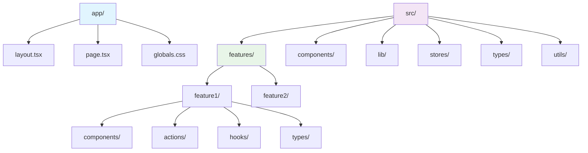
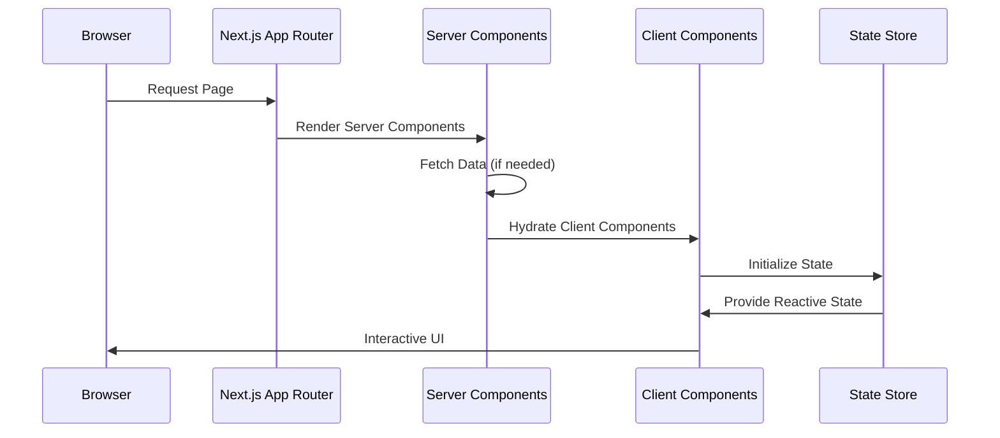

# Next.js基本セットアップ Design Document

## 概要

お薬サポートアプリケーションにおいて、Node.js環境からNext.js 15 + React 19 + Server Componentsへの移行を実現し、Feature-based Architectureに基づくモダンなフロントエンド基盤を構築する。ADR-0001で承認された技術スタックを用いて、段階的移行とリスクコントロールを重視した実装戦略を採用。

## 背景とコンテキスト

### 前提となるADR

- **ADR-0001-nextjs-tech-stack-selection.md**: Next.js 15、React 19、Tailwind CSS v4、shadcn/ui、段階的テスト統合の技術選定
- 今後作成予定: ADR-COMMON-ERROR-HANDLING（エラーハンドリング戦略）
- 今後作成予定: ADR-COMMON-STATE-MANAGEMENT（状態管理戦略）
- 今後作成予定: ADR-COMMON-API-DESIGN（API設計原則）

### 合意事項チェックリスト

#### スコープ
- [x] Next.js 15 + React 19基盤環境の構築
- [x] Tailwind CSS v4設定とzero-configuration対応
- [x] shadcn/ui段階的導入（canary版制約考慮）
- [x] Feature-based Architectureディレクトリ構造の実装
- [x] Vitest → Playwright → Storybookの段階的テスト統合
- [x] パフォーマンス測定とWeb Vitals対応

#### 非スコープ（明示的に変更しないもの）
- [x] 既存のBiome設定（lintとフォーマット）
- [x] 既存のTypeScript strict mode設定
- [x] 既存のGitワークフロー（Husky、lint-staged）
- [x] 既存のpackage.jsonスクリプト構造の根本変更

#### 制約条件
- [x] 並行運用: あり（2週間の段階的移行期間）
- [x] 後方互換性: 不要（完全移行のため）
- [x] パフォーマンス測定: 必要（Web Vitals指標達成）

### 解決する問題

現在のNode.js環境では以下の制約により、モダンなWebアプリケーション開発が困難となっている：

1. **Server Componentsの活用不可**: React 18環境でのSSR制限
2. **開発効率の低下**: 従来のCSS Modulesによる低速スタイリング
3. **アーキテクチャの不整備**: LLM主導実装に最適化されていない構造
4. **テスト統合の不備**: 断片的なテスト環境による品質保証の限界

### 現状の課題

- **技術的負債**: React 18基盤による最新機能活用の制限
- **開発速度の制約**: 従来のビルドツールチェーンによる低速ビルド
- **コンポーネント管理の複雑性**: 統一されたデザインシステムの欠如
- **品質保証の不完全性**: E2Eテストとコンポーネントテストの分離

### 要件

#### 機能要件

- Next.js 15 App Router基盤での完全なSSR/Server Components対応
- Tailwind CSS v4による高速スタイリングシステム
- shadcn/uiによるアクセシブルなコンポーネントライブラリ統合
- Feature-based Architectureによる自己完結型機能モジュール
- Vitest/Playwright/Storybookによる包括的テスト環境

#### 非機能要件

- **パフォーマンス**: LCP 2.5秒以下、INP 200ms以下、CLS 0.1以下
- **スケーラビリティ**: 機能追加時の相互依存性最小化
- **信頼性**: 自動テストカバレッジ70%以上、品質チェック完全自動化
- **保守性**: LLM実装効率最大化、1機能1ファイル原則の徹底

## 受入条件（Acceptance Criteria）

各機能要件に対して、実装が成功したと判断できる具体的かつ検証可能な条件を定義します。

### 基盤環境構築
- [ ] Next.js 15プロジェクトが正常に作成され、`npm run dev`でサーバーが起動する
- [ ] React 19のServer Componentsが動作し、基本的なSSRページが表示される
- [ ] TypeScript strict modeでエラーなくコンパイルできる

### スタイリングシステム
- [ ] Tailwind CSS v4が導入され、`@import "tailwindcss"`のみでスタイルが適用される
- [ ] globals.cssでTailwindクラスが正常に認識される
- [ ] 既存のBiome設定と競合なく動作する

### コンポーネントライブラリ
- [ ] shadcn/ui CLIで基本コンポーネント（Button、Card等）が正常にインストールできる
- [ ] @radix-ui/react-icons代替として react-icons または lucide-react が動作する
- [ ] コンポーネントのダークモード対応が機能する

### アーキテクチャ構造
- [ ] Feature-based Architectureのディレクトリ構造が正しく配置される
- [ ] `src/features/[feature-name]/components/index.ts`からのexportが機能する
- [ ] 他featuresへの直接import禁止ルールがBiomeで検出される

### テスト統合
- [ ] VitestによるReactコンポーネントテストが実行される
- [ ] PlaywrightによるE2Eテストが基本的なページで動作する
- [ ] Storybook統合が成功するか、または代替のTestingLibrary + Jest環境が構築される

### パフォーマンス
- [ ] Lighthouse CIによる測定でLCP 2.5秒以下を達成する
- [ ] INP（Interaction to Next Paint）200ms以下でインタラクション応答性を確保する
- [ ] Web Vitalsライブラリでリアルユーザーメトリクスが収集できる
- [ ] Next.js Imageコンポーネントが適切に最適化される

## 既存コードベース分析

### 実装パスマッピング
| 種別 | パス | 説明 |
|------|------|------|
| 既存 | src/index.ts | Node.js環境のエントリーポイント（削除予定） |
| 新規 | app/layout.tsx | Next.js App Routerのルートレイアウト |
| 新規 | app/page.tsx | トップページ（Server Component） |
| 新規 | app/globals.css | Tailwind CSS v4インポート |
| 新規 | src/features/ | Feature-based機能モジュール |
| 既存 | vitest.config.ts | Vitest設定（Next.js対応に更新） |
| 既存 | package.json | 依存関係の大幅更新 |

### 統合点（新規実装でも記載）
- **統合先**: 既存のBiome設定、TypeScript設定、Git workflow
- **呼び出し方法**: package.jsonスクリプトからの継続的利用

## 設計

### 変更影響マップ

```yaml
変更対象: Node.js環境からNext.js 15環境への完全移行
直接影響:
  - src/index.ts（削除）
  - package.json（依存関係大幅変更）
  - tsconfig.json（Next.js対応設定追加）
  - vitest.config.ts（React Testing設定更新）
間接影響:
  - 開発コマンド（npm run dev → Next.js開発サーバー）
  - ビルド出力（dist/ → .next/）
  - 実行時依存（Node.js → Next.js Runtime）
波及なし:
  - Biome設定（linting、formatting）
  - TypeScript strict mode
  - Git workflow（Husky、lint-staged）
  - テスト実行コマンド（npm test）
```

### アーキテクチャ概要

Next.js 15 App Routerを基盤として、Feature-based Architectureにより自己完結型の機能モジュールを配置。各機能は`src/features/[feature-name]/`ディレクトリ内で完結し、外部への依存を最小化。Server ComponentsとClient Componentsの適切な分離により、パフォーマンスとインタラクティビティを両立。



### データフロー



### 統合点一覧

| 統合点 | 場所 | 旧実装 | 新実装 | 切り替え方法 |
|---------|------|----------|----------|-------------|
| エントリーポイント | package.json | src/index.ts | app/page.tsx | scripts更新 |
| スタイリング | CSS設定 | CSS Modules | Tailwind v4 | globals.css置換 |
| コンポーネント | UI要素 | 手動実装 | shadcn/ui | 段階的置換 |
| テスト実行 | vitest.config.ts | Node.js環境 | React/DOM環境 | 設定ファイル更新 |

### 主要コンポーネント

#### Next.js App Router基盤
- **責務**: SSR/SSG、ルーティング、Server Components実行
- **インターフェース**: App Routerファイルベースルーティング
- **依存関係**: React 19、Next.js 15

#### Feature-based Module System
- **責務**: 機能ごとの自己完結型モジュール管理
- **インターフェース**: `src/features/[name]/components/index.ts`によるexport
- **依存関係**: 共通stores、typesのみ

#### Tailwind CSS v4 System
- **責務**: 高速スタイリング、デザインシステム統一
- **インターフェース**: CSS クラス、CSS変数
- **依存関係**: PostCSS、CSS import

#### shadcn/ui Component Library
- **責務**: アクセシブルで一貫性のあるUIコンポーネント
- **インターフェース**: React Components、Radix UI基盤
- **依存関係**: @radix-ui/react-*, react-icons/lucide-react

### 型定義

```typescript
// Next.js App Router ページ型
interface PageProps {
  params: Record<string, string>
  searchParams: Record<string, string | string[] | undefined>
}

// Feature Module構造
interface FeatureModule {
  components: Record<string, React.ComponentType>
  actions?: Record<string, Function>
  hooks?: Record<string, Function>
  types?: Record<string, unknown>
}

// Tailwind設定型（v4）
interface TailwindConfig {
  theme: Record<string, unknown>
  plugins: Array<Plugin>
}

// shadcn/ui コンポーネント基本型
interface ShadcnComponentProps {
  className?: string
  children?: React.ReactNode
  [key: string]: unknown
}
```

### データ契約（Data Contract）

#### Feature Module Component

```yaml
入力:
  型: React.ComponentProps<T>
  前提条件: 必要なpropsの型チェック
  検証: PropTypes または TypeScript による静的検証

出力:
  型: JSX.Element
  保証: アクセシブルなHTML構造
  エラー時: ErrorBoundaryによるキャッチ

不変条件:
  - 外部features への直接依存禁止
  - stores経由でのデータアクセスのみ許可
```

#### Tailwind Style System

```yaml
入力:
  型: string (CSS class names)
  前提条件: Tailwind v4対応クラス
  検証: PurgeCSS による未使用クラス検出

出力:
  型: CSS styles
  保証: モバイルファースト、ダークモード対応
  エラー時: デフォルトスタイルにフォールバック

不変条件:
  - デザインシステムの一貫性維持
  - パフォーマンス劣化の防止
```

### エラーハンドリング

- **React Error Boundary**: コンポーネントレベルでのエラーキャッチ
- **Next.js Error Pages**: `error.tsx`による統一エラー表示
- **Server Components**: async/awaitとtry-catchによるサーバーサイドエラー処理
- **Form Actions**: Server Actionsでのフォーム送信エラー処理

### ログとモニタリング

- **Development**: console.logによるデバッグ情報
- **Production**: Web Vitalsによるパフォーマンス測定
- **Error Tracking**: Error Boundaryによるエラー収集
- **Lighthouse CI**: 継続的パフォーマンス監視

## 実装計画

### 実装アプローチの選択

**選択したアプローチ**: ハイブリッド（基盤水平スライス + 機能垂直スライス）

**選択理由**:
1. **Phase 1（水平スライス）**: 既存システムからの移行のため、安定した技術基盤の構築が最優先
2. **Phase 2-3（垂直スライス）**: Feature-based Architectureの特性を活かし、機能ごとの完結実装
3. **Phase 4（水平スライス）**: 全体統合とテスト環境の包括的構築

**統合ポイント**: Phase 2完了時にFeature-based構造で最初の機能が動作し、Phase 4完了時に全体が統合されたテスト環境で動作

### フェーズ分け

#### フェーズ1: 基盤環境構築（水平スライス）
**目的**: Next.js 15基盤とTailwind CSS v4の安定稼働環境を構築

**実装内容**:
- Next.js 15プロジェクト初期化とpackage.json依存関係更新
- App Routerディレクトリ構造作成（app/layout.tsx, page.tsx, globals.css）
- Tailwind CSS v4設定（zero-configuration対応）
- TypeScript設定のNext.js対応更新
- 基本的なServer ComponentとClient Componentのサンプル実装

**フェーズ完了条件**:
- [x] `npm run dev`でNext.js開発サーバーが正常起動
- [x] TypeScript strict modeでコンパイルエラーなし
- [x] Tailwind CSS v4のスタイルが正常適用

**E2E確認手順**:
1. `npm run dev`実行してlocalhost:3000でページアクセス
2. ブラウザ開発者ツールでTailwindスタイルの適用確認
3. TypeScript型チェック（`npm run build`）の成功確認

**確認レベル**: L1（機能動作確認）- ユーザーがブラウザでページを閲覧可能

#### フェーズ2: Feature-based構造実装（垂直スライス）
**目的**: Feature-based Architectureディレクトリ構造の構築と最初の機能実装

**実装内容**:
- `src/features/`ディレクトリ構造作成
- `src/components/`, `src/lib/`, `src/stores/`, `src/types/`, `src/utils/`基盤ディレクトリ
- サンプル機能（例：患者情報表示）のFeature-based実装
- **機能間依存制御のためのBiome lint設定追加**

**具体的Biome lint設定例**:
```json
// biome.json
{
  "linter": {
    "enabled": true,
    "rules": {
      "correctness": {
        "noUndeclaredVariables": "error"
      },
      "style": {
        "noImplicitBoolean": "error"
      },
      "nursery": {
        // Feature間の直接import禁止ルール
        "noRestrictedImports": {
          "level": "error",
          "options": {
            "paths": [
              {
                "name": "@/features/**/components",
                "message": "Feature間の直接import禁止。shared storeまたはAPIを使用してください。",
                "allowTypeImports": false
              },
              {
                "name": "../*/features",
                "message": "相対パスによるfeature間import禁止。絶対パスを使用してください。"
              }
            ],
            "patterns": [
              {
                "regex": "^\\.\\.\/.*\/features\/(?!.*\/(types|stores|api)).*$",
                "message": "Feature間では types, stores, api のみimport可能です。"
              }
            ]
          }
        }
      }
    }
  }
}
```

**許可されるimportパターン**:
```typescript
// ✅ 許可されるimport
import { PatientStore } from '@/stores/patient'           // 共通store
import { ApiClient } from '@/lib/api'                     // 共通API
import { Button } from '@/components/ui/button'           // 共通コンポーネント
import type { Patient } from '@/types/patient'            // 型定義

// ❌ 禁止されるimport 
import { PatientCard } from '@/features/patient/components'  // 他featureコンポーネント
import { usePatientData } from '../patient/hooks'           // 相対パス
```

**フェーズ完了条件**:
- [x] Feature-based構造のディレクトリが完全配置
- [x] 最初の機能がServer/Client Component分離で動作
- [x] 機能間の適切な依存関係制御が機能

**E2E確認手順**:
1. サンプル機能ページの表示確認
2. Server ComponentとClient Componentの適切な分離動作
3. 他featureへの直接import試行でlintエラー発生確認

**確認レベル**: L1（機能動作確認）- 特定機能がエンドユーザーにとって利用可能

#### フェーズ3: shadcn/ui統合（垂直スライス）
**目的**: shadcn/uiコンポーネントライブラリの段階的導入と制約対応

**実装内容**:
- shadcn/ui CLI初期化（canary版制約考慮）
- **アイコンライブラリ移行**: react-icons（包括的）またはlucide-react（軽量）による@radix-ui/react-icons代替
- 基本コンポーネント（Button、Card、Dialog等）の導入
- ダークモード対応設定

**具体的移行手順**:
```typescript
// 1. 依存関係追加
npm install react-icons
// または
npm install lucide-react

// 2. shadcn/ui設定更新
// components.json
{
  "style": "default",
  "rsc": true,
  "tsx": true,
  "tailwind": {
    "config": "tailwind.config.ts",
    "css": "app/globals.css",
    "baseColor": "slate",
    "cssVariables": true,
    "prefix": ""
  },
  "aliases": {
    "components": "@/components",
    "utils": "@/lib/utils"
  },
  "iconLibrary": "react-icons" // または "lucide"
}

// 3. コンポーネント内での使用例
// react-icons使用例
import { FiUser, FiSettings, FiChevronDown } from 'react-icons/fi'
import { HiOutlineHeart } from 'react-icons/hi'

// lucide-react使用例  
import { User, Settings, ChevronDown, Heart } from 'lucide-react'

// 4. 既存@radix-ui/react-iconsの置換
// 変更前: import { ChevronDownIcon } from '@radix-ui/react-icons'
// 変更後: import { ChevronDown } from 'lucide-react'
```

**shadcn/ui canary版安定性確認手順**:
```bash
# 1. canary版の最新状況確認
npm info @radix-ui/react-primitive versions --json

# 2. テスト環境での動作確認
npm run build && npm run start

# 3. 主要コンポーネントの動作テスト
# - Button, Dialog, Dropdown系コンポーネント
# - Form系コンポーネント（Input, Select, Checkbox）
# - 複雑なコンポーネント（Command, Calendar, DataTable）
```

**フェーズ完了条件**:
- [x] shadcn/ui基本コンポーネントが正常動作
- [x] アイコンライブラリ代替が機能
- [x] ダークモード切り替えが動作

**E2E確認手順**:
1. shadcn/uiコンポーネントを使用したページの表示確認
2. アイコン表示とインタラクション確認
3. ダークモード切り替え動作確認

**確認レベル**: L1（機能動作確認）- UIコンポーネントがエンドユーザーに提供される

#### フェーズ4: テスト統合環境構築（水平スライス）
**目的**: Vitest + Playwright + Storybook統合テスト環境の構築

**実装内容**:
- Vitest設定のReact/Next.js対応更新
- Playwright E2Eテスト基盤構築
- **Storybook統合制約対応**またはTestingLibrary + Jest代替の実装
- 包括的品質チェックスクリプト整備

**Storybook統合制約事項と対応策**:

⚠️ **既知の制約**:
1. **@storybook/addon-vitest動作不可**: Next.js 15でReactモジュール競合により自動テスト不可
2. **React 19バージョン競合**: Next.js 15.1.7が使用するReact 19.0.0-rc-65e06cb7とStorybook内Reactの不整合

**対応策1: @storybook/nextjs-viteフレームワーク使用**
```bash
# 1. Storybook初期化（Next.js 15対応）
npx storybook@latest init --type nextjs

# 2. 手動でnextjs-viteフレームワーク設定
npm install @storybook/nextjs-vite --save-dev

# 3. .storybook/main.ts設定
export default {
  framework: '@storybook/nextjs-vite', // 重要: nextjsではなくnextjs-vite
  docs: { autodocs: 'tag' },
  addons: [
    '@storybook/addon-essentials',
    // '@storybook/addon-vitest' は削除（動作不可）
  ]
}
```

**対応策2: TestingLibrary + Jest分離環境**
```bash
# 1. Jest環境構築
npm install jest jest-environment-jsdom @testing-library/jest-dom --save-dev

# 2. jest.config.js
module.exports = {
  testEnvironment: 'jsdom',
  setupFilesAfterEnv: ['<rootDir>/jest.setup.js'],
  testPathIgnorePatterns: ['<rootDir>/.storybook/']
}

# 3. 独立したコンポーネントテスト実行
npm run test:components
```

**段階的テスト統合戦略の見直し**:
- **Phase 4a**: Storybookデザインテスト環境構築（UIコンポーネント表示確認）
- **Phase 4b**: Vitestによる分離されたコンポーネントテスト（ロジック検証）
- **Phase 4c**: Playwrightによる統合E2Eテスト（フル機能確認）

**フェーズ完了条件**:
- [x] Vitestによるコンポーネントテストが実行可能
- [x] PlaywrightによるE2Eテストが実行可能
- [x] Storybook統合成功（@storybook/nextjs-viteフレームワーク使用）またはTestingLibrary + Jest環境動作
- [x] `npm run check:all`で全品質チェック通過

**E2E確認手順**:
1. `npm test`でVitestテスト全通過
2. `npm run test:e2e`（新規）でPlaywrightテスト実行
3. Storybook起動確認（@storybook/nextjs-viteまたは代替TestingLibrary）
4. `npm run check:all`で品質チェック全通過

**確認レベル**: L2（テスト動作確認）- 新規テストが追加されパス

### 移行戦略

**3-4週間段階的移行**（テスト統合複雑性を考慮）:
- **Week 1-2**: Phase 1-2（基盤構築 + Feature構造）
- **Week 3**: Phase 3（shadcn/ui統合と制約対応）
- **Week 4**: Phase 4（テスト統合環境構築）
- **並行運用**: 既存環境との比較テスト実施
- **ロールバック体制**: 各Phase完了時点でのコミット管理による即座復帰可能性

## テスト戦略

### テスト設計の基本方針

受入条件から自動的にテストケースを導出し、各受入条件に対して最低1つのテストケースを作成。Feature-based Architectureの特性を活かし、機能ごとに自己完結したテスト群を構築。

### 単体テスト（Vitest）

**テスト対象**:
- Server ComponentとClient Componentの個別動作
- Feature内のhooksとactionsロジック
- utilsとlibの純粋関数

**カバレッジ目標**: 70%以上

**テスト例**:
```typescript
// src/features/patient/components/PatientCard.test.tsx
import { render, screen } from '@testing-library/react'
import { PatientCard } from './PatientCard'

test('患者情報が正しく表示される', () => {
  const patient = { name: '田中太郎', age: 65 }
  render(<PatientCard patient={patient} />)
  expect(screen.getByText('田中太郎')).toBeInTheDocument()
  expect(screen.getByText('65歳')).toBeInTheDocument()
})
```

### 統合テスト（Vitest + React Testing Library）

**テスト対象**:
- Feature間のstores経由データ連携
- Server ComponentからClient Componentへのprops受け渡し
- フォーム送信とServer Actions連携

**重要テストケース**:
- Feature-based構造での適切な依存関係
- Tailwind CSSスタイルの適用確認
- shadcn/uiコンポーネントの統合動作

### E2Eテスト（Playwright）

**テスト対象**:
- ユーザージャーニー全体の動作確認
- SSR/Client-side遷移の適切な動作
- レスポンシブデザインとダークモード

**テスト例**:
```typescript
// tests/e2e/basic-navigation.spec.ts
import { test, expect } from '@playwright/test'

test('基本ナビゲーションが動作する', async ({ page }) => {
  await page.goto('/')
  await expect(page.locator('h1')).toContainText('お薬サポート')
  await page.click('[data-testid="patient-link"]')
  await expect(page).toHaveURL('/patients')
})
```

### パフォーマンステスト（Lighthouse CI）

**測定指標**:
- LCP: 2.5秒以下（2025年基準維持）
- INP: 200ms以下（FIDから置き換え、2024年3月より正式採用）
- CLS: 0.1以下（2025年基準維持）

**自動測定設定**:
```json
// lighthouse-ci.config.json
{
  "ci": {
    "collect": {
      "numberOfRuns": 5,
      "url": ["http://localhost:3000"]
    },
    "assert": {
      "assertions": {
        "largest-contentful-paint": ["error", {"maxNumericValue": 2500}],
        "interaction-to-next-paint": ["error", {"maxNumericValue": 200}],
        "cumulative-layout-shift": ["error", {"maxNumericValue": 0.1}]
      }
    }
  }
}
```

## セキュリティ考慮事項

- **Server Components**: 機密情報のサーバーサイド処理、クライアント漏洩防止
- **環境変数**: NEXT_PUBLIC_プレフィックス以外の自動除外
- **CSP設定**: Content Security Policyによるクロスサイト攻撃防止
- **依存関係**: npm auditによる脆弱性継続監視

## 今後の拡張性

- **Multi-language Support**: i18nライブラリ統合対応
- **PWA対応**: Service Worker、オフライン機能追加
- **マイクロフロントエンド**: Feature-based構造の独立デプロイ対応
- **API統合**: tRPC、GraphQLエンドポイント統合

## 代替案の検討

### 代替案1: Next.js 14 + React 18継続
- **概要**: 安定版での段階的移行
- **利点**: 既知問題回避、安定性確保
- **欠点**: Server Components最新機能活用不可、将来性制限
- **不採用の理由**: プロジェクト目標であるモダン技術活用に合致しない

### 代替案2: Vite + React SPA
- **概要**: Next.jsを使わずVite基盤のSPA
- **利点**: 軽量性、シンプルさ
- **欠点**: SSR/SEO対応の複雑さ、Server Components活用不可
- **不採用の理由**: フルスタック機能とSEO要件に対応困難

## リスクと軽減策

| リスク | 影響度 | 発生確率 | 軽減策 |
|--------|--------|----------|--------|
| shadcn/ui canary版の不安定性 | 中 | 中 | react-icons/lucide-react代替、段階的導入、代替コンポーネント準備 |
| Storybook統合失敗（Next.js 15 Reactモジュール競合） | 高 | 高 | @storybook/nextjs-viteフレームワークまたはTestingLibrary + Jest代替 |
| @storybook/addon-vitest動作不可 | 中 | 高 | Storybook UI テストまたは分離されたVitest環境での代替 |
| パフォーマンス目標未達（INP 200ms要件） | 高 | 低 | Lighthouse CI継続監視、INP測定の最適化手法事前調査 |
| 移行期間延長（テスト統合複雑性） | 中 | 高 | 3-4週間計画、フェーズごとのマイルストーン管理、ロールバック体制 |

## 参考資料

- [Next.js 15公式ドキュメント](https://nextjs.org/docs) - App Router、Server Components実装ガイド
- [React 19 Migration Guide](https://react.dev/blog/2024/12/05/react-19) - forwardRef除去、useフック活用
- [Tailwind CSS v4ドキュメント](https://tailwindcss.com/docs) - zero-configuration、CSS-first設定
- [shadcn/ui React 19対応ガイド](https://ui.shadcn.com/docs/react-19) - canary版使用の注意事項
- [Feature-based Architecture with Next.js](https://www.thecandidstartup.org/2025/01/06/component-test-playwright-vitest.html) - LLM最適化パターン
- [Modern Testing with Vitest, Storybook, Playwright](https://www.defined.net/blog/modern-frontend-testing/) - 統合テスト戦略
- [Web Vitals公式ガイド](https://web.dev/vitals/) - パフォーマンス測定と最適化
- [Next.js Performance Best Practices](https://nextjs.org/docs/app/building-your-application/optimizing) - 画像最適化、コード分割

## 更新履歴

| 日付 | 版 | 変更内容 | 作成者 |
|------|-----|----------|--------|
| 2025-08-17 | 1.0 | 初版作成 | Claude Code |
| 2025-08-17 | 1.1 | Critical修正項目対応（ISSUE-001〜003）<br/>- Web Vitals指標更新：INP 200ms導入、FCP除去<br/>- Storybook統合制約の詳細化と代替策追加<br/>- shadcn/ui移行手順の具体化<br/>- 移行期間を3-4週間に延長<br/>- Biome lint設定の具体例追加 | Claude Code |