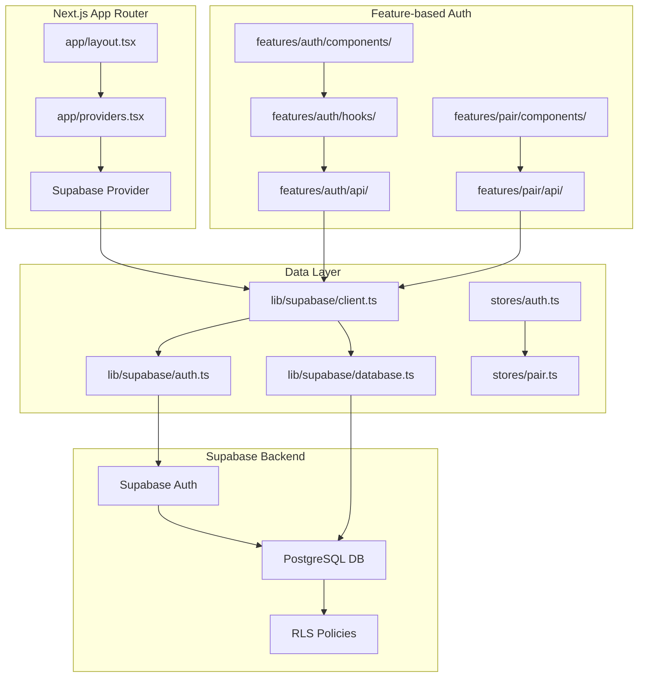
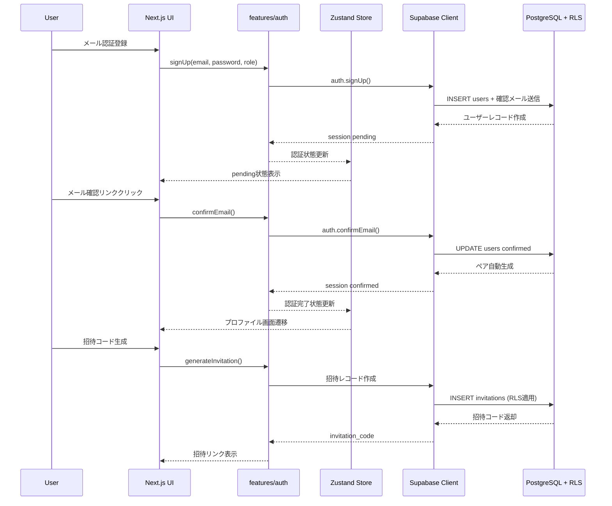
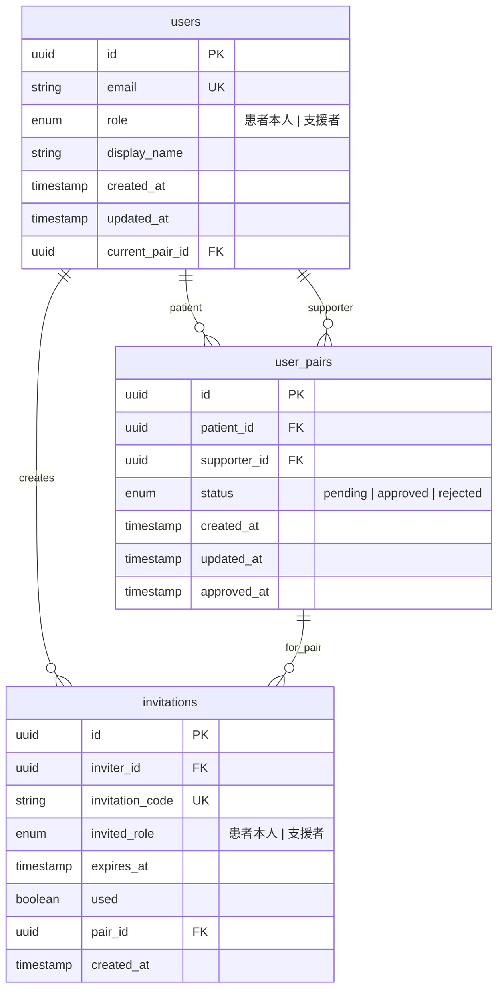

# Supabase認証・データベース基盤実装 Design Document

## 概要

Supabase Auth + PostgreSQL DBとNext.js 15 + Feature-based Architectureを統合し、患者本人と支援者の1対1ペア構造による認証・権限管理システムを実装する。医療関連データの安全な管理と双方向招待システムによる「共同体としてのサポート」を実現する。

## 背景とコンテキスト

### 前提となるADR

- **ADR-0001-nextjs-tech-stack-selection.md**: Next.js 15 + TypeScript + Feature-based Architecture基盤選定
- **ADR-0002-supabase-auth-database-selection.md**: Supabase認証・データベースプラットフォーム選定（TypeScript strict mode対応、RLS完全対応）

### 合意事項チェックリスト

#### スコープ
- [x] Supabase認証システム統合（Next.js 15 + Feature-based Architecture準拠）
- [x] メール認証フロー実装（確認メール送信・認証完了プロセス）
- [x] ペアベース権限システム（患者・支援者1対1構造）
- [x] 双方向招待システム（患者→支援者、支援者→患者の両方向対応）
- [x] ユーザープロファイル管理（患者本人/支援者の基本情報管理）
- [x] データベーススキーマ設計（ユーザー、ペア関係、権限管理）
- [x] RLS（Row Level Security）による厳格なデータアクセス制御
- [x] セッション管理（ログイン状態の永続化と自動延長）

#### 非スコープ（明示的に変更しないもの）
- [x] 服薬記録機能（次期フェーズで実装）
- [x] 通知システム（プッシュ通知・メール通知は別途実装）
- [x] 決済・課金機能（無料サービスとして設計）
- [x] 管理者機能（カスタマーサポート用管理画面は別フェーズ）
- [x] データエクスポート機能（医療法対応後に検討）

#### 制約条件
- [x] 並行運用: なし（認証システム新規構築）
- [x] 後方互換性: 不要（新規実装）
- [x] パフォーマンス測定: 必要（認証処理2秒以内、DB応答500ms以内）
- [x] TypeScript strict mode遵守: 必要（any型禁止）
- [x] Feature-based Architecture準拠: 必要（`lib/`と`features/auth/`への集約）

### 解決する問題

**現状**: 認証システムが未実装のため、ユーザー管理・権限制御・医療データ保護が不可能
**課題**: 患者本人と支援者の対等な協力関係を実現する認証・権限システムが必要
**目標**: ペアベース権限による「共同体としてのサポート」を技術的に実現

### 現状の課題

1. **認証システム未実装**: ユーザー識別・セッション管理が不可能
2. **データベース未構築**: ユーザー情報・関係性データの永続化不可能
3. **権限制御なし**: 医療関連データへのアクセス制御が不可能
4. **ペア管理機能なし**: 患者・支援者の関係性管理が不可能

### 要件

#### 機能要件

- **Supabase認証統合**: メール認証、セッション管理、JWT token管理
- **ユーザープロファイル**: 患者本人/支援者の識別・基本情報管理
- **ペアベース権限**: 患者1名・支援者1名の固定ペア構造
- **双方向招待**: どちらからでも相手を招待可能な招待コード/リンク生成
- **RLSセキュリティ**: PostgreSQL Row Level Securityによる厳格なアクセス制御
- **Feature-based統合**: 既存アーキテクチャパターンへの完全統合

#### 非機能要件

- **パフォーマンス**: 認証処理2秒以内、データベースクエリ500ms以内（RLS適用下）
- **スケーラビリティ**: 同時ログインユーザー数1,000名対応、総ユーザー10,000名対応
- **信頼性**: 認証システム可用性99.5%以上（Supabase SLA依存）
- **保守性**: TypeScript strict mode完全準拠、Feature-based Architecture原則遵守

## 受入条件（Acceptance Criteria）

各機能要件に対して、実装が成功したと判断できる具体的かつ検証可能な条件を定義。

### 認証機能
- [ ] **メール認証成功**: 正しいメールアドレスでアカウント作成時、確認メールが送信され、リンククリックで認証完了する
- [ ] **ログイン成功**: 認証済みユーザーが正しいメールアドレス・パスワードでログインが成功する
- [ ] **セッション維持**: ブラウザ再起動後もログイン状態が維持される
- [ ] **ログアウト成功**: ログアウトボタンクリック時、セッションが無効化され未認証状態になる

### ユーザープロファイル管理
- [ ] **プロファイル作成**: ユーザー種別（患者本人/支援者）の選択と基本情報入力が可能
- [ ] **プロファイル表示**: ログイン後に自分のプロファイル情報が正しく表示される
- [ ] **プロファイル更新**: 基本情報の変更が即座に反映される

### ペアベース権限システム
- [ ] **ペア自動生成**: ユーザー登録時に2名枠のペア（患者・支援者用）が自動作成される
- [ ] **権限制御**: 患者は自分のデータに完全アクセス、支援者は承認されたペアの患者データのみ閲覧可能
- [ ] **データ分離**: 他のペアのデータには一切アクセスできない

### 双方向招待システム
- [ ] **患者→支援者招待**: 患者が支援者用招待コード/リンクを生成・送信可能
- [ ] **支援者→患者招待**: 支援者が患者用招待コード/リンクを生成・送信可能
- [ ] **招待承認**: 招待を受けた側が参加申請し、先に登録した側が承認してペア完成
- [ ] **招待期限**: 招待コードは7日間の有効期限付きで自動無効化

### データベース・セキュリティ
- [ ] **RLS動作**: 全テーブルでRow Level Securityが有効で権限外データアクセスが完全に阻止される
- [ ] **データ整合性**: ペア関係の作成・更新・削除時にACID準拠の整合性が保たれる
- [ ] **型安全性**: Supabase型定義により全データ操作がTypeScript strict modeでコンパイル成功

### パフォーマンス・エラーハンドリング
- [ ] **認証処理速度**: アカウント作成・ログイン処理が2秒以内で完了
- [ ] **DB応答速度**: ペア情報取得・権限チェックが500ms以内で応答
- [ ] **エラーメッセージ**: 認証エラー・ネットワークエラー時に適切なユーザーフィードバックが表示される

## 既存コードベース分析

### 実装パスマッピング
| 種別 | パス | 説明 |
|------|------|------|
| 既存 | `src/features/patient/` | 患者関連UI（認証と統合予定） |
| 既存 | `src/stores/index.ts` | 状態管理（認証状態追加） |
| 既存 | `src/types/index.ts` | 型定義（Supabase型追加） |
| 新規 | `src/lib/supabase/` | Supabase設定・クライアント |
| 新規 | `src/features/auth/` | 認証機能（完結実装） |
| 新規 | `src/features/pair/` | ペア管理機能 |
| 新規 | `src/middleware.ts` | Next.js認証ミドルウェア |

### 統合点（新規実装）
- **統合先**: Next.js App Router middleware、既存stores、既存features
- **呼び出し方法**: 
  - App Router page.tsxからfeatures/auth/componentsをimport
  - middlewareでSupabase Auth状態チェック
  - storesでグローバル認証状態管理

## 設計

### 変更影響マップ

```yaml
変更対象: 
  - 認証システム（新規）
  - データベーススキーマ（新規）
  - ペア権限システム（新規）
直接影響:
  - src/app/layout.tsx（Provider追加）
  - src/app/providers.tsx（Supabase Provider統合）
  - src/stores/（認証状態ストア追加）
  - src/types/（Supabase型定義追加）
間接影響:
  - 既存features（認証状態依存に変更）
  - package.json（Supabase依存関係追加）
  - 環境変数（Supabase設定値追加）
波及なし:
  - 既存UIコンポーネント（components/ui/）
  - テスト設定（vitest.config.ts）
  - ビルド設定（next.config.js）
```

### アーキテクチャ概要



### データフロー図



### データベーススキーマ設計



### RLSポリシー設計

#### usersテーブル
```sql
-- ユーザーは自分の情報のみアクセス可能
CREATE POLICY users_own_data ON users
FOR ALL USING (auth.uid() = id);

-- 承認済みペア相手の基本情報は閲覧可能
CREATE POLICY users_pair_data ON users
FOR SELECT USING (
  EXISTS (
    SELECT 1 FROM user_pairs 
    WHERE status = 'approved' 
    AND (
      (patient_id = auth.uid() AND supporter_id = users.id) OR
      (supporter_id = auth.uid() AND patient_id = users.id)
    )
  )
);
```

#### user_pairsテーブル
```sql
-- ペア当事者のみアクセス可能
CREATE POLICY pairs_member_access ON user_pairs
FOR ALL USING (
  auth.uid() = patient_id OR auth.uid() = supporter_id
);
```

#### invitationsテーブル
```sql
-- 招待者は自分の招待のみ作成・閲覧可能
CREATE POLICY invitations_owner_access ON invitations
FOR ALL USING (auth.uid() = inviter_id);

-- 招待コード所有者は該当招待を閲覧可能（招待承認用）
CREATE POLICY invitations_code_access ON invitations
FOR SELECT USING (true);  -- 招待コードでの検索は別途アプリ層で制御
```

### 統合点一覧

| 統合点 | 場所 | 旧実装 | 新実装 | 切り替え方法 |
|---------|------|----------|----------|-------------|
| 認証状態管理 | app/providers.tsx | なし | SupabaseProvider | Provider追加 |
| ページ保護 | middleware.ts | なし | auth.getUser() | Next.js middleware |
| 状態管理 | stores/ | index.ts | auth.ts + pair.ts | Zustand store追加 |
| 型定義 | types/ | index.ts | supabase.ts | 生成型import |

### 主要コンポーネント

#### features/auth/components/
- **責務**: 認証UI（サインアップ、ログイン、プロファイル）とフォーム管理
- **インターフェース**: React Components（AuthForm, ProfileForm, SignOutButton）
- **依存関係**: features/auth/hooks/, stores/auth, lib/supabase/auth

#### features/auth/hooks/
- **責務**: 認証ロジック（useAuth, useSignUp, useSignIn, useProfile）
- **インターフェース**: React Hooks（状態管理とSupabaseクライアント操作）
- **依存関係**: lib/supabase/auth, stores/auth

#### lib/supabase/
- **責務**: Supabase設定・クライアント・型定義の一元管理
- **インターフェース**: supabaseClient, authHelpers, DatabaseTypes
- **依存関係**: @supabase/ssr, 環境変数

#### features/pair/components/
- **責務**: ペア管理UI（招待コード生成、ペア承認、ペア状態表示）
- **インターフェース**: React Components（InvitationForm, PairStatus, PairApproval）
- **依存関係**: features/pair/hooks/, stores/pair

### 型定義

```typescript
// lib/supabase/types.ts - Supabase CLIで自動生成される型
export type Database = {
  public: {
    Tables: {
      users: {
        Row: {
          id: string
          email: string
          role: 'patient' | 'supporter'
          display_name: string | null
          created_at: string
          updated_at: string
          current_pair_id: string | null
        }
        Insert: {
          id?: string
          email: string
          role: 'patient' | 'supporter'
          display_name?: string | null
          created_at?: string
          updated_at?: string
          current_pair_id?: string | null
        }
        Update: {
          id?: string
          email?: string
          role?: 'patient' | 'supporter'
          display_name?: string | null
          updated_at?: string
          current_pair_id?: string | null
        }
      }
      user_pairs: {
        Row: {
          id: string
          patient_id: string
          supporter_id: string
          status: 'pending' | 'approved' | 'rejected'
          created_at: string
          updated_at: string
          approved_at: string | null
        }
        Insert: {
          id?: string
          patient_id: string
          supporter_id: string
          status?: 'pending' | 'approved' | 'rejected'
          created_at?: string
          updated_at?: string
          approved_at?: string | null
        }
        Update: {
          status?: 'pending' | 'approved' | 'rejected'
          updated_at?: string
          approved_at?: string | null
        }
      }
      invitations: {
        Row: {
          id: string
          inviter_id: string
          invitation_code: string
          invited_role: 'patient' | 'supporter'
          expires_at: string
          used: boolean
          pair_id: string
          created_at: string
        }
        Insert: {
          id?: string
          inviter_id: string
          invitation_code: string
          invited_role: 'patient' | 'supporter'
          expires_at: string
          used?: boolean
          pair_id: string
          created_at?: string
        }
        Update: {
          used?: boolean
        }
      }
    }
  }
}

// アプリケーション型定義
export type User = Database['public']['Tables']['users']['Row']
export type UserInsert = Database['public']['Tables']['users']['Insert']
export type UserPair = Database['public']['Tables']['user_pairs']['Row']
export type Invitation = Database['public']['Tables']['invitations']['Row']

// 認証状態型
export interface AuthState {
  user: User | null
  session: Session | null
  loading: boolean
}

// ペア状態型
export interface PairState {
  currentPair: UserPair | null
  pairPartner: User | null
  pendingInvitations: Invitation[]
  loading: boolean
}
```

### データ契約（Data Contract）

#### features/auth/hooks/useSignUp

```yaml
入力:
  型: { email: string; password: string; role: 'patient' | 'supporter'; displayName: string }
  前提条件: 
    - email: 有効なメール形式
    - password: 8文字以上、数字+英字含む
    - role: 'patient' | 'supporter'のいずれか
    - displayName: 1文字以上50文字以下
  検証: Zodスキーマによるバリデーション

出力:
  型: { success: boolean; user?: User; error?: string }
  保証: 
    - success=trueの場合、userが必ず存在
    - success=falseの場合、errorメッセージが存在
  エラー時: { success: false, error: string }

不変条件:
  - 同じメールアドレスで複数のユーザーは作成できない
  - ペアは自動生成され、初期状態は'pending'
```

#### features/pair/hooks/useInvitation

```yaml
入力:
  型: { invitedRole: 'patient' | 'supporter' }
  前提条件:
    - 現在のユーザーが認証済み
    - 現在のユーザーのペアが存在
    - 招待相手の席が空いている（patient/supporterどちらか）
  検証: ペア状態とロール整合性チェック

出力:
  型: { invitationCode: string; expiresAt: string; inviteLink: string }
  保証:
    - invitationCodeは8桁の英数字
    - expiresAtは現在時刻+7日
    - inviteLinkは有効なURL形式
  エラー時: throw Error

不変条件:
  - 1ペアにつき同時に有効な招待は1つまで
  - 招待は7日で自動無効化
```

### エラーハンドリング

```typescript
// エラーの種類と対処方法
export enum AuthErrorType {
  NETWORK_ERROR = 'network_error',           // ネットワーク接続エラー
  INVALID_CREDENTIALS = 'invalid_credentials', // 認証情報エラー
  EMAIL_NOT_CONFIRMED = 'email_not_confirmed', // メール未確認
  PAIR_LIMIT_EXCEEDED = 'pair_limit_exceeded', // ペア上限エラー
  INVITATION_EXPIRED = 'invitation_expired',   // 招待期限切れ
  RLS_ACCESS_DENIED = 'rls_access_denied',     // RLS権限エラー
}

export interface AuthError {
  type: AuthErrorType
  message: string
  details?: Record<string, unknown>
}

// エラーハンドラー
export const handleAuthError = (error: unknown): AuthError => {
  if (error instanceof AuthError) return error
  
  // Supabaseエラーの変換
  if (error?.message?.includes('Invalid login credentials')) {
    return {
      type: AuthErrorType.INVALID_CREDENTIALS,
      message: 'メールアドレスまたはパスワードが正しくありません'
    }
  }
  
  // 一般的なネットワークエラー
  return {
    type: AuthErrorType.NETWORK_ERROR,
    message: 'ネットワークエラーが発生しました。しばらく時間をおいて再度お試しください。'
  }
}
```

### ログとモニタリング

```typescript
// 構造化ログ出力
export const authLogger = {
  signUp: (userId: string, role: string) => {
    console.log(JSON.stringify({
      event: 'user_signup',
      userId,
      role,
      timestamp: new Date().toISOString(),
    }))
  },
  
  pairCreated: (pairId: string, patientId: string, supporterId: string) => {
    console.log(JSON.stringify({
      event: 'pair_created',
      pairId,
      patientId,
      supporterId,
      timestamp: new Date().toISOString(),
    }))
  },
  
  authError: (error: AuthError, userId?: string) => {
    console.error(JSON.stringify({
      event: 'auth_error',
      errorType: error.type,
      errorMessage: error.message,
      userId,
      timestamp: new Date().toISOString(),
    }))
  }
}
```

## 実装計画

### 実装アプローチの選択
メタ認知的戦略選択プロセスに基づく判定：

**判定結果**: **垂直スライス**アプローチを採用
- **理由**: 認証機能→ペア機能の順で機能単位での完結実装が適切
- **根拠**: 外部依存（Supabase）との統合が重要で、機能ごとに価値提供が可能
- **統合ポイント**: Phase 2でペア機能統合時に全体動作確認

### フェーズ分け

#### フェーズ1: Supabase基盤・認証機能実装
**目的**: Supabase統合とメール認証フローの完全動作実現

**実装内容**:
- Supabase設定・クライアント実装（`lib/supabase/`）
- データベーススキーマ作成・RLSポリシー設定
- メール認証フロー（サインアップ・ログイン・プロファイル）
- Next.js middleware認証チェック
- 認証状態管理（Zustand store）
- TypeScript型定義統合

**フェーズ完了条件**:
- [x] Supabase接続・設定完了（環境変数、型生成）
- [x] メール認証フロー動作（サインアップ→確認メール→ログイン）
- [x] ユーザープロファイル作成・表示・更新機能
- [x] 認証状態の永続化・セッション管理
- [x] RLS基本ポリシー動作（ユーザーデータアクセス制御）

**E2E確認手順**:
1. **アカウント作成テスト**: 
   - メールアドレス・パスワードでアカウント作成
   - 確認メールの受信・リンククリック
   - プロファイル画面への自動遷移確認
2. **ログインテスト**:
   - 作成したアカウントでログイン成功
   - ブラウザ再起動後のセッション維持確認
   - ログアウト・再ログイン動作確認
3. **権限テスト**:
   - 他ユーザーのデータへのアクセス拒否確認
   - 未認証状態でのページアクセス制御確認

**確認レベル**: L2（機能完結確認）

#### フェーズ2: ペアベース権限・双方向招待実装
**目的**: ペア構造による権限制御と招待システムの完全実装

**実装内容**:
- ペア管理機能（`features/pair/`）
- 双方向招待システム（招待コード生成・承認プロセス）
- ペアベースRLSポリシー実装
- ペア状態管理（Zustand store）
- 権限に応じたUI表示制御

**フェーズ完了条件**:
- [x] ペア自動生成（ユーザー登録時）
- [x] 双方向招待（患者→支援者、支援者→患者）
- [x] 招待承認プロセス（申請→承認→ペア完成）
- [x] ペアベース権限制御（患者：完全権限、支援者：閲覧権限）
- [x] 招待期限管理（7日間自動無効化）

**E2E確認手順**:
1. **患者主導ペア形成テスト**:
   - 患者アカウント作成→支援者招待コード生成
   - 支援者がコードで参加申請→患者が承認
   - ペア完成後の権限確認（患者：完全アクセス、支援者：閲覧のみ）
2. **支援者主導ペア形成テスト**:
   - 支援者アカウント作成→患者招待コード生成
   - 患者がコードで参加申請→支援者が承認
   - ペア完成後の権限確認
3. **権限分離テスト**:
   - 他のペアのデータへのアクセス完全阻止確認
   - 支援者の患者データ変更権限なし確認

**確認レベル**: L3（システム全体統合確認）

### 移行戦略

**新規実装のため移行は不要**。ただし、以下の段階的展開を実施：

1. **開発環境でのフル機能テスト**
2. **ステージング環境でのパフォーマンス・セキュリティテスト**
3. **本番環境での段階的ロールアウト**

## テスト戦略

### テスト設計の基本方針

受入条件から自動的にテストケースを導出：
- 各受入条件に対して最低1つのテストケースを作成
- 受入条件の測定可能な基準をアサーションとして実装

### 単体テスト

**方針**: 各hook、API関数の個別動作を検証
**カバレッジ目標**: 85%以上

**主要テストケース**:
- `useSignUp`: メール形式、パスワード強度、ロール検証
- `useInvitation`: 招待コード生成、期限管理、ペア整合性
- `authHelpers`: RLSポリシー関数、権限チェックロジック

### 統合テスト

**方針**: Supabase統合、コンポーネント間連携を検証
**重要テストケース**:
- 認証フロー統合（サインアップ→メール確認→ログイン）
- ペア形成統合（招待生成→承認→権限付与）
- RLS統合（権限制御、データ分離）

### E2Eテスト

**方針**: ユーザーシナリオ全体の動作を検証
**テストシナリオ**:
- 患者主導のペア形成完了シナリオ
- 支援者主導のペア形成完了シナリオ
- 権限分離・セキュリティシナリオ

### パフォーマンステスト

**方針**: 非機能要件の達成を検証
**測定項目**:
- 認証処理応答時間（目標: 2秒以内）
- データベースクエリ応答時間（目標: 500ms以内）
- 同時ログインユーザー負荷（目標: 1,000ユーザー）

## セキュリティ考慮事項

### データ保護
- **RLS（Row Level Security）**: 全テーブルで有効化、ペア単位でのデータアクセス制御
- **暗号化**: Supabase標準のAES-256暗号化（保存時・転送時）
- **セッション管理**: JWT署名検証、適切なトークンリフレッシュ

### 認証セキュリティ
- **パスワードポリシー**: 8文字以上、英数字組み合わせ必須
- **メール認証**: 確認メール送信によるメールアドレス検証
- **セッション無効化**: ログアウト時の完全なセッション削除

### データアクセス制御
- **最小権限の原則**: ユーザーロール（patient/supporter）に基づく最小限のアクセス権限
- **監査ログ**: 全認証イベント・データアクセスのログ記録
- **アクセス時効**: 招待コードの7日間自動無効化

## 今後の拡張性

### Phase 3以降の拡張計画
- **ソーシャルログイン**: Google/Apple認証の追加
- **多要素認証（MFA）**: SMS/認証アプリによる追加セキュリティ
- **ペア管理高度機能**: 支援者権限変更、一時停止、ペア解除
- **ログイン履歴**: セキュリティ監視のためのアクセス履歴

### アーキテクチャ拡張性
- **マイクロサービス移行**: 認証サービスの分離可能性を考慮した設計
- **API化**: GraphQL対応とバージョニング戦略
- **スケーラビリティ**: 10,000ユーザー超への対応準備

## 代替案の検討

### 代替案1: Firebase Authentication
- **概要**: Google Firebase Authenticationとの統合
- **利点**: 成熟したエコシステム、豊富なOAuth選択肢、リアルタイムDB
- **欠点**: RLS機能なし、NoSQL制約、TypeScript統合の複雑さ
- **不採用の理由**: ペアベースの細かい権限制御が困難、医療データに適さないNoSQL

### 代替案2: NextAuth.js + 自前DB
- **概要**: NextAuth.jsとPostgreSQLの自前構築
- **利点**: 完全な制御、カスタマイズ自由度、ベンダーロックなし
- **欠点**: 開発・保守コスト高、セキュリティリスク自己責任
- **不採用の理由**: 開発効率とセキュリティリスクのトレードオフで不適切

## リスクと軽減策

| リスク | 影響度 | 発生確率 | 軽減策 |
|--------|--------|----------|--------|
| Supabase型生成の複雑化 | 高 | 中 | 段階的実装、型チェック自動化、ダミー型での開発並行 |
| RLS設定の複雑性 | 高 | 中 | 詳細なテストケース作成、権限マトリックス設計検証 |
| 双方向招待フローのUX複雑化 | 中 | 高 | ユーザビリティテスト、シンプルなガイド提供 |
| パフォーマンス目標未達 | 中 | 中 | 早期プロトタイプでの性能測定、最適化計画 |
| Supabase SLA依存リスク | 低 | 低 | SLA監視、フォールバック計画、将来的な自己ホスト検討 |

## 参考資料

### 最新技術情報（2024-2025年調査結果）
- [Supabase Next.js 15 Server-Side Auth](https://supabase.com/docs/guides/auth/server-side/nextjs) - Cookie-based認証の公式実装ガイド
- [Supabase Row Level Security Best Practices](https://supabase.com/docs/guides/database/postgres/row-level-security) - RLSポリシー設計の詳細手順
- [Next.js 15 + Supabase Cookie-Based Auth (2025 Guide)](https://the-shubham.medium.com/next-js-supabase-cookie-based-auth-workflow-the-best-auth-solution-2025-guide-f6738b4673c1) - 最新の認証ワークフロー実装パターン
- [Healthcare Database Schema with RLS](https://maxlynch.com/2023/11/04/tips-for-row-level-security-rls-in-postgres-and-supabase/) - 医療システム向けRLS設計のベストプラクティス

### プロジェクト関連資料
- `docs/prd/supabase-auth-setup-prd.md` - ビジネス要件とユーザーストーリー
- `docs/adr/ADR-0001-nextjs-tech-stack-selection.md` - Next.js基盤技術選定
- `docs/adr/ADR-0002-supabase-auth-database-selection.md` - Supabase選定根拠と技術比較

### 技術仕様
- `docs/rules/architecture/feature-based/rules.md` - Feature-based Architecture実装ルール
- `docs/rules/technical-spec.md` - プロジェクト技術設計ルール
- `docs/rules/typescript.md` - TypeScript strict mode開発ルール

## 更新履歴

| 日付 | 版 | 変更内容 | 作成者 |
|------|-----|----------|--------|
| 2025-08-19 | 1.0 | 初版作成 - Supabase認証・データベース基盤実装設計 | Claude Code |

---

**作成日**: 2025年8月19日  
**ステータス**: Draft  
**承認待ち**: 実装開始前にユーザー承認が必要