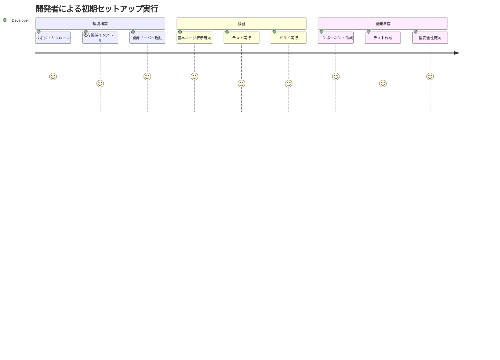
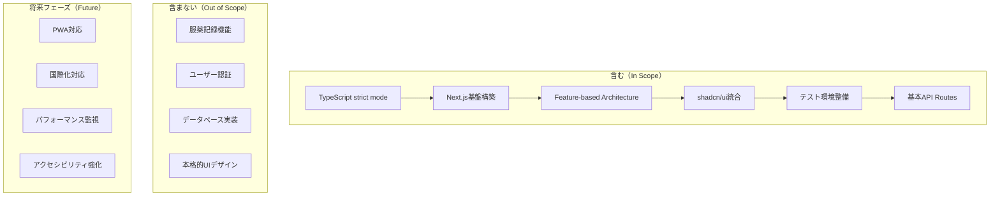

# PRD: お薬サポートアプリケーション - 初期セットアップフェーズ

## 概要

### 1行要約
服薬記録を優しくサポートするNext.jsベースのWebアプリケーションの技術基盤を構築する

### 背景
定期的な服薬記録を必要とする患者本人と、それをサポートする家族等の支援者に向けて、「飲めなかった」ことを否定せず記録できたことを肯定するスタンスでのアプリケーションを開発する。現在のTypeScriptプロジェクトテンプレートから、実用的なWebアプリケーションへの転換が必要。

## ユーザーストーリー

### プライマリーユーザー
- **患者本人**: 定期的な服薬が必要な方（年齢問わず、慢性疾患や治療中の方）
- **支援者**: 患者をサポートする家族、介護者（管理者ではなく、共同体としてのサポート役）

### ユーザーストーリー
```
As a 開発チーム
I want to 堅牢で保守性の高いNext.jsアプリケーション基盤を構築したい
So that 患者と支援者が安心して利用できる品質の高いサービスを提供できる

As a 患者
I want to アプリケーションが高速で安定して動作することを期待する
So that 服薬記録時にストレスを感じない
```

### ユースケース
1. 開発者がローカル環境でアプリケーションを起動し、基本ページが表示される
2. CI/CDパイプラインでテストが自動実行され、品質が保証される
3. 将来の機能追加時に、統一されたアーキテクチャパターンで開発できる

## 機能要件

### 必須要件（MVP）
- [ ] Next.js 15 + Biome + Vitestの統合とプロジェクト構造の構築
- [ ] TypeScript strict modeの維持と型安全性の確保
- [ ] Feature-based Architectureの実装（features/ディレクトリ構造、components/ui/shadcn統合、stores/状態管理基盤の作成）
- [ ] shadcn/uiコンポーネントライブラリの統合（Tailwind CSS v4使用、shadcn/ui公式サポート済み）
- [ ] 基本ページ構成（ホーム、ログイン予定画面、404ページ等）
- [ ] 完全なテスト環境の構築（Vitest + Playwright + Storybook）
- [ ] API Routes基盤の設定（健康チェック、環境変数管理）
- [ ] レスポンシブデザイン基盤の設定
- [ ] 環境変数管理とセキュリティ設定
- [ ] ESLint/Prettier設定の最適化（Biomeとの共存、設定競合解決手順の明確化）

### 追加要件（Nice to Have）
- [ ] PWA対応の基盤設定
- [ ] 国際化対応の基盤（i18n）
- [ ] パフォーマンス監視の基盤設定
- [ ] アクセシビリティ対応の基盤設定
- [ ] Tailwind CSS v4の導入と最適化（2025年1月22日安定版リリース済み、パフォーマンス大幅向上）

### 対象外（Out of Scope）
- 服薬記録機能の実装: 初期セットアップフェーズでは技術基盤のみに専念
- ユーザー認証機能: 後続フェーズで実装
- データベース統合: API Routes基盤のみを設定
- 本格的なUIデザイン: コンポーネントライブラリ統合まで

## 非機能要件

### パフォーマンス
- ページ初期ロード時間: 3秒以内
- Lighthouse Performance Score: 90以上
- ビルド時間: 5分以内
- Tailwind CSS v4による高速化: フルビルド5倍、インクリメンタルビルド100倍高速化を活用

### 信頼性
- テストカバレッジ: jest coverage reports、単体テスト70%、統合テスト10%以上
- TypeScript strict mode: エラー0
- ビルドエラー: 0

### セキュリティ
- 環境変数の適切な管理（.env.localファイル分離）
- HTTPS対応の基盤設定
- セキュリティヘッダーの設定

### 拡張性
- 新機能追加時のスケーラブルなアーキテクチャ
- コンポーネントの再利用性確保
- API設計の拡張性

## 成功基準

### 定量的指標
1. TypeScript strict modeでエラー0
2. テスト実行成功率: 100%
3. ビルド成功率: 100%
4. Lighthouse Performance Score: 90以上
5. Bundle size: 500KB未満（初期状態）
6. CSSビルド時間: v4高速化により従来比80%短縮を達成

### 定性的指標
1. 開発者が直感的に理解できるプロジェクト構造
2. README記載の5ステップ手順で、エラー0での環境構築完了（30分以内）
3. コンポーネントの追加が既存パターンに従って簡単に行える

## 技術的考慮事項

### 依存関係
- Node.js 20（既存環境）
- TypeScript 5.0（既存設定維持）
- 既存のBiome設定との互換性
- 既存のVitest設定の拡張

### 技術統合要件
- **Next.js 15 + Biome + Vitest統合手順**:
  1. Next.js 15のインストールと基本設定
  2. 既存Biome設定との競合解決（package.json scripts競合の解決手順）
  3. Vitestとの統合テスト（ESLintルール競合時の優先順位設定）
  4. 設定ファイルの検証と最適化
- **設定競合の具体的解決策**:
  - package.json scriptsでBiome優先、ESLint補完の構成
  - TypeScript設定でstrict mode維持
  - テスト設定でVitest優先、Jest互換性確保

### 制約
- 既存のTypeScript strict mode設定の維持
- Feature-based Architectureの厳守
- YAGNI原則の徹底（必要最小限の実装）
- any型使用の完全禁止

### リスクと軽減策
| リスク | 影響度 | 発生確率 | 軽減策 |
|--------|--------|----------|--------|
| Next.js導入による既存設定の競合 | 高 | 中 | 段階的導入、設定ファイルの詳細検証、package.json scripts競合の解決手順 |
| shadcn/ui導入による型エラー | 中 | 中 | TypeScript strict mode下での検証、ESLintルール競合時の優先順位設定 |
| テスト環境の複雑化 | 中 | 低 | 既存Vitest設定の段階的拡張 |
| パフォーマンス劣化 | 低 | 低 | 初期段階でのLighthouse監視 |
| Tailwind CSS v4設定の複雑化 | 低 | 低 | v4公式ドキュメント参照、shadcn/ui公式サポート活用 |

## ユーザージャーニー図



## スコープ境界図



## 付録

### 参考資料
- [Next.js 15 公式ドキュメント](https://nextjs.org/docs)
- [shadcn/ui 公式ドキュメント](https://ui.shadcn.com/)
- プロジェクトのFeature-based Architecture: `docs/rules/architecture/feature-based/rules.md`
- TypeScript設定ルール: `docs/rules/typescript.md`

### 用語集
- **Feature-based Architecture**: 機能単位でコードを整理するアーキテクチャパターン
- **shadcn/ui**: Radix UIベースのコンポーネントライブラリ
- **TypeScript strict mode**: TypeScriptの最も厳格な型チェック設定
- **YAGNI原則**: "You Aren't Gonna Need It" - 必要になるまで実装しない開発原則
- **API Routes基盤**: Next.jsのAPI Routes機能を活用したバックエンド処理の基盤
- **レスポンシブデザイン基盤**: モバイル・タブレット・デスクトップに対応したUI基盤設定
- **環境変数管理**: .env.localファイル分離による安全な設定値管理

---

**作成日**: 2025年8月17日  
**バージョン**: 2.1  
**ステータス**: Draft

## 変更履歴

### v2.1 (2025年8月17日)
- **Tailwind CSS v4採用の方針変更**（PRD-007）:
  - 変更前: "初期導入時はTailwind CSS v3で開始し、v4安定版リリース後（2025年3月予定）に移行計画を策定"
  - 変更後: "Tailwind CSS v4を最初から採用（2025年1月22日安定版リリース済み、shadcn/ui公式サポート済み）"
  - 理由: v4安定版リリース済み、shadcn/ui公式サポート開始、パフォーマンス大幅向上（フルビルド5倍、インクリメンタルビルド100倍高速化）
- **パフォーマンス成功基準の追加**（PRD-008）:
  - "CSSビルド時間: v4高速化により従来比80%短縮を達成"を追加
  - "Tailwind CSS v4による高速化: フルビルド5倍、インクリメンタルビルド100倍高速化を活用"を非機能要件に追加
- **リスク項目の更新**（PRD-009）:
  - "Tailwind v4移行の計画遅延"を"Tailwind CSS v4設定の複雑化"に変更
  - v3→v4移行リスクの削除により、設定簡素化を実現

### v2.0 (2025年8月17日)
- **成功基準の測定可能性向上**（PRD-002）:
  - テストカバレッジ指標を具体化: "jest coverage reports、単体テスト70%、統合テスト10%以上"
  - 環境構築成功基準を具体化: "README記載の5ステップ手順で、エラー0での環境構築完了（30分以内）"
- **技術要件の詳細化**（PRD-001）:
  - Next.js 15 + Biome + Vitestの統合手順を明記
  - 設定競合の具体的な解決策を追加（package.json scripts競合、ESLintルール競合等）
- **Tailwind v4移行計画**（PRD-003）:
  - "初期導入時はTailwind CSS v3で開始し、v4安定版リリース後（2025年3月予定）に移行計画を策定"の方針を明記
- **Feature-based Architecture実装要件**（PRD-005）:
  - 具体的な成果物を明記: "features/ディレクトリ構造、components/ui/shadcn統合、stores/状態管理基盤の作成"
- **ユーザーストーリーの充実**（PRD-004）:
  - エンドユーザー視点を追加: "As a 患者 I want to アプリケーションが高速で安定して動作することを期待する So that 服薬記録時にストレスを感じない"
- **用語集の拡充**（PRD-006）:
  - "API Routes基盤"、"レスポンシブデザイン基盤"、"環境変数管理"の定義を追加

### v1.0 (2025年8月17日)
- 初版作成