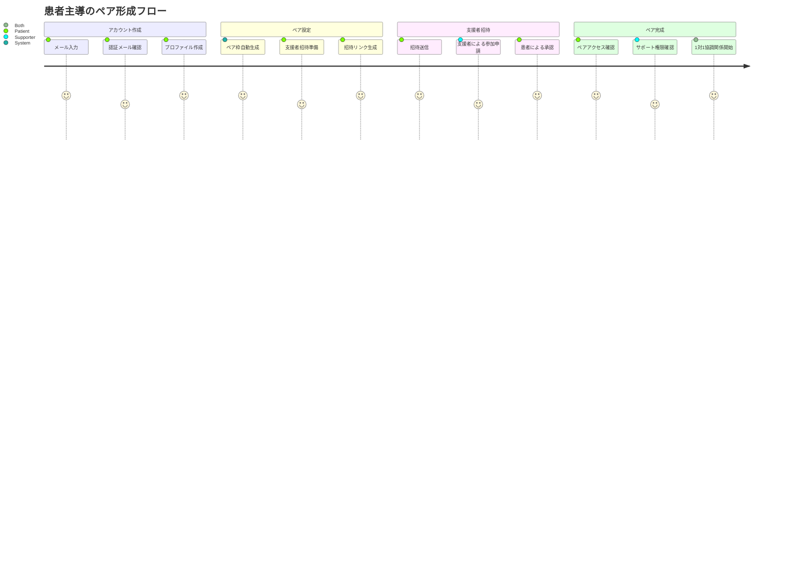
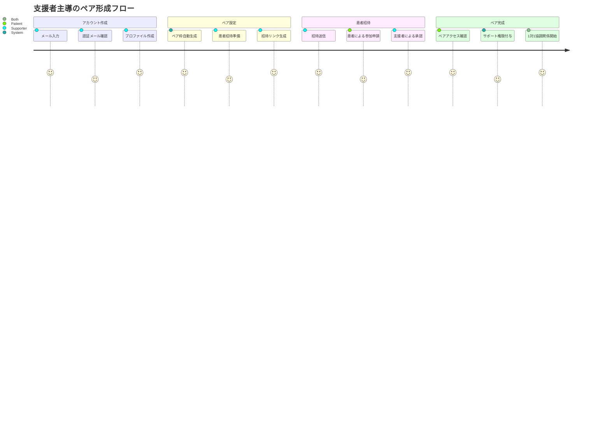
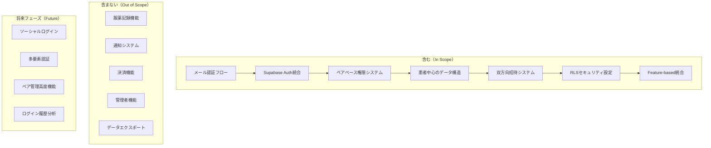
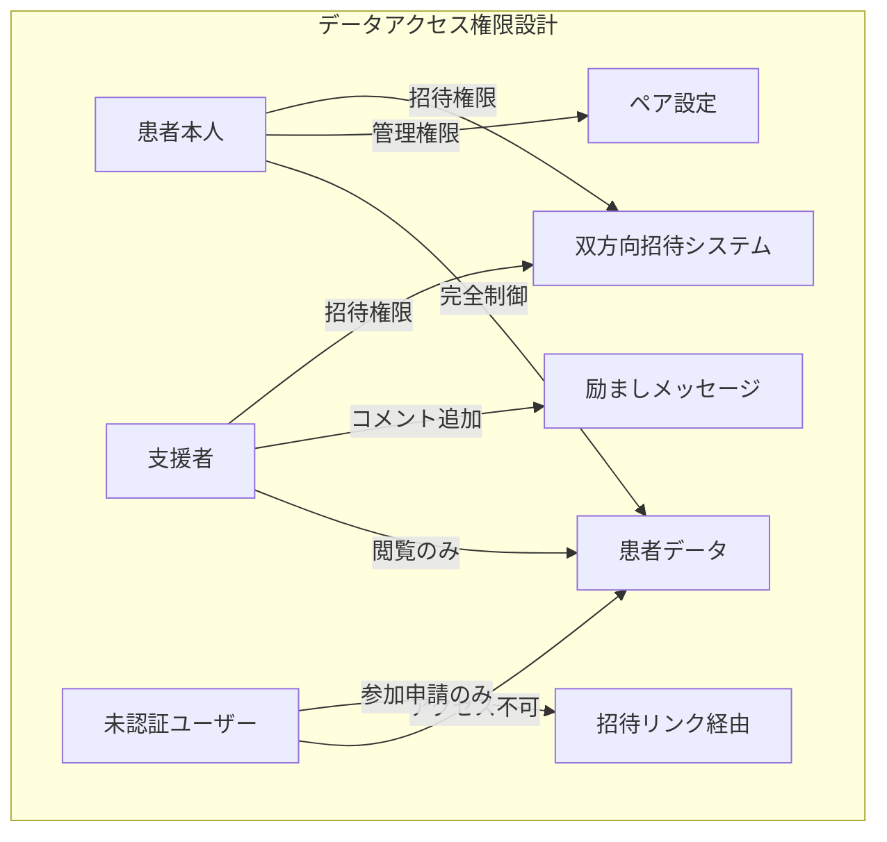

# PRD: お薬サポートアプリケーション - Supabase認証・データベース基盤構築

## 概要

### 1行要約

Supabase認証システムとグループベース権限管理を構築し、患者本人と支援者が安全で協調的な関係で服薬支援を行える基盤を実現する

### 背景

初期セットアップフェーズで構築されたNext.js 15技術基盤の上に、実用的なWebアプリケーションとして必要な認証・データベース・権限管理機能を追加する。患者本人と支援者が対等な立場でグループを形成し、「管理」ではなく「共同体としてのサポート」を実現するユーザー体験を構築する必要がある。

## ユーザーストーリー

### プライマリーユーザー

- **患者本人**: 定期的な服薬が必要な方（年齢問わず、慢性疾患や治療中の方）
- **支援者**: 患者をサポートする家族、介護者（管理者ではなく、共同体としてのサポート役）

### ユーザーストーリー

```
As a 患者本人
I want to 安全にアカウントを作成し、1名の信頼できる支援者とペアを形成したい
So that プライバシーを保ちながら、1対1の関係で服薬記録をサポートしてもらえる

As a 支援者
I want to 患者本人から招待を受けるか、患者を招待してペアを形成したい
So that 双方向の信頼関係で、協力的な服薬支援を行える

As a 開発チーム
I want to セキュアで拡張性のある認証・データベース基盤を構築したい
So that ユーザーの個人情報と医療関連データを安全に管理できる
```

### ユースケース

1. **患者主導のペア形成**
   - 患者本人がメール認証でアカウント作成
   - 患者専用のグループ（2名枠）が自動生成される
   - 支援者招待用のリンクまたはコードを発行

2. **支援者主導のペア形成**
   - 支援者がメール認証でアカウント作成
   - 患者招待用のリンクまたはコードを発行
   - 患者本人が参加申請し、支援者が承認

3. **ペア承認プロセス**
   - どちらが先でも、後から参加する方が参加申請
   - 先に登録したユーザーが承認してペアを完成
   - 各々に適切な権限を付与（患者：完全権限、支援者：サポート権限）

4. **データアクセス権限の制御**
   - 患者本人は自分のデータに完全アクセス権
   - 支援者は閲覧・励ましコメント権限のみ
   - ペア外のユーザーは一切アクセス不可

## 機能要件

### 必須要件（MVP）

- [ ] **Supabase認証システム統合**: Next.js 15 + Feature-based Architectureに準拠したSupabase Auth実装
- [ ] **メール認証フロー**: アカウント作成時の確認メール送信・認証完了プロセス
- [ ] **ユーザープロファイル管理**: 患者本人/支援者の基本情報管理（氏名、関係性、連絡先）
- [ ] **ペアベース権限システム**: 患者・支援者1対1のペア構造とロールベースアクセス制御
- [ ] **ペア自動生成**: ユーザー登録時の2名枠ペア自動作成（患者・支援者どちらが先でも対応）
- [ ] **双方向招待システム**: 患者→支援者、支援者→患者の両方向招待リンク/コード生成・送信・承認フロー
- [ ] **データベーススキーマ設計**: ユーザー、グループ、権限管理のためのSupabaseテーブル設計
- [ ] **セッション管理**: ログイン状態の永続化と自動延長
- [ ] **セキュリティ設定**: RLS（Row Level Security）による厳格なデータアクセス制御
- [ ] **エラーハンドリング**: 認証エラー、ネットワークエラーの適切な処理とユーザーフィードバック

### 追加要件（Nice to Have）

- [ ] **ソーシャルログイン**: Google/Apple認証の追加選択肢
- [ ] **多要素認証（MFA）**: SMS/認証アプリによる追加セキュリティ
- [ ] **パスワードポリシー**: 強度チェックと安全なパスワード推奨
- [ ] **ログイン履歴**: セキュリティ監視のためのアクセス履歴記録
- [ ] **アカウント復旧**: パスワードリセット・アカウント無効化からの復旧
- [ ] **ペア管理機能**: 支援者の権限変更・ペア解除・一時停止

### 対象外（Out of Scope）

- **服薬記録機能**: 認証基盤完成後の次期フェーズで実装
- **通知システム**: プッシュ通知・メール通知は別途実装
- **決済・課金機能**: 現時点では無料サービスとして設計
- **管理者機能**: カスタマーサポート用の管理画面は別フェーズ
- **データエクスポート**: 医療データの外部出力機能は医療法対応後に検討

## 非機能要件

### パフォーマンス

- 認証処理レスポンスタイム: 2秒以内
- データベースクエリ応答時間: 500ms以内（RLS適用下）
- 同時ログインユーザー数: 1,000ユーザー対応
- ペア招待処理: 3秒以内（メール送信含む）

### 信頼性

- 認証システム可用性: 99.5%以上（Supabase SLA依存）
- データ整合性: ACID準拠トランザクション処理
- バックアップ: 自動バックアップ（Supabase標準機能活用）
- 障害復旧時間: 15分以内（RTO）

### セキュリティ

- **データ暗号化**: 保存時・転送時の暗号化（AES-256）
- **認証トークン**: JWT署名検証とスコープ制限
- **RLS適用**: すべてのデータテーブルでRow Level Security有効化
- **HTTPS強制**: すべての通信でTLS 1.3以上を使用
- **個人情報保護**: 医療関連データの適切な匿名化・アクセス制御
- **セッション管理**: 適切なタイムアウト設定と自動無効化

### 拡張性

- ユーザー数スケーリング: 10,000ユーザーまで対応（初期段階）
- ペア構成: 1患者につき1支援者の固定ペア構造
- データベース設計: 将来の機能拡張を見越した正規化設計
- API設計: GraphQL対応とバージョニング戦略

## 成功基準

### 定量的指標

1. **認証成功率**: 95%以上（ネットワークエラーを除く）
2. **ユーザー登録完了率**: アカウント作成開始から認証完了まで80%以上
3. **ペア招待成功率**: 招待送信から参加完了まで70%以上
4. **セキュリティテスト**: 脆弱性スキャンでクリティカル問題0件
5. **データ整合性**: RLSテストで権限外アクセス0件
6. **パフォーマンス**: 認証処理2秒以内達成率95%以上
7. **テストカバレッジ**: 認証機能80%以上、権限管理90%以上

### 定性的指標

1. **ユーザー体験の直感性**: 開発チーム外メンバーが5分以内でアカウント作成完了
2. **双方向招待の簡便性**: 患者・支援者どちらからでも説明なしで相手を招待可能
3. **セキュリティの安心感**: ユーザーがプライバシー保護を実感できるUI/UX
4. **エラーメッセージの親切性**: 技術に不慣れなユーザーでも理解可能な表現

## 技術的考慮事項

### 依存関係

- **既存基盤**: Next.js 15 + TypeScript + Feature-based Architecture（構築完了済み）
- **認証プロバイダー**: Supabase Auth（メール認証、OAuth対応）
- **データベース**: Supabase PostgreSQL（RLS機能活用）
- **状態管理**: 既存のZustand統合（認証状態・ユーザー情報管理）
- **UI コンポーネント**: 既存のshadcn/ui（認証フォーム・権限表示UI）

### アーキテクチャ統合要件

- **Feature-based Structure準拠**: `features/auth/`配下に認証関連機能を集約
- **型安全性**: TypeScript strict mode下でSupabase型定義の完全活用
- **テスト戦略**: 既存のVitest + Playwright環境でE2E認証テスト
- **環境変数管理**: 既存パターンに従ったSupabase設定値管理

### 制約

- Supabase無料プランの制限内での実装（月間アクティブユーザー5万人まで）
- 既存のTypeScript strict mode設定の維持
- Feature-based Architectureルールの厳格な遵守
- any型使用の完全禁止（Supabase型生成の活用）

### リスクと軽減策

| リスク | 影響度 | 発生確率 | 軽減策 |
|--------|--------|----------|--------|
| Supabase型生成の複雑化 | 高 | 中 | TypeScript strict mode対応の段階的実装、型チェック自動化 |
| RLS設定の複雑性 | 高 | 中 | 詳細なテストケース作成、権限マトリックスによる設計検証 |
| 双方向招待フローのUX複雑化 | 中 | 高 | ユーザビリティテスト実施、シンプルなフォローアップメッセージ |
| 認証状態の競合 | 中 | 中 | Zustand状態管理パターンの確立、ミドルウェア活用 |
| Feature-based構造との統合 | 低 | 低 | 既存アーキテクチャルールの詳細確認、段階的実装 |

## ユーザージャーニー図





## スコープ境界図



## 権限マトリックス図



## 付録

### 参考資料

- [Supabase Auth公式ドキュメント](https://supabase.com/docs/guides/auth)
- [Supabase Row Level Security](https://supabase.com/docs/guides/auth/row-level-security)
- 既存PRD: `docs/prd/initial-setup-prd.md`（基盤構築完了済み）
- プロジェクトアーキテクチャ: `docs/rules/architecture/feature-based/rules.md`
- [Next.js 15 + Supabase統合ガイド](https://supabase.com/docs/guides/getting-started/tutorials/with-nextjs)

### 用語集

- **ペアベース権限**: 患者・支援者1対1のペア単位でのデータアクセス制御
- **RLS（Row Level Security）**: データベース行レベルでのアクセス制御機能
- **支援者**: 患者をサポートする家族・介護者（管理者ではなく協力者として位置付け）
- **Supabase Auth**: Supabaseが提供する認証・認可サービス
- **Feature-based Architecture**: 機能単位でコードを整理するアーキテクチャパターン
- **共同体としてのサポート**: 管理・監視ではなく、対等な立場での協力関係
- **患者中心設計**: 患者本人が主導権を持ち、支援者が補助する権限構造
- **双方向招待**: 患者・支援者どちらからでも相手を招待できる仕組み
- **1対1ペア構造**: 患者1名・支援者1名の固定ペア関係

---

**作成日**: 2025年8月19日  
**バージョン**: 1.1  
**ステータス**: Draft

## 変更履歴

### v1.1 (2025年8月20日)

- **ペア構造への変更**（PRD-012）:
  - グループベース → ペアベース（患者1名・支援者1名の固定構造）
  - 双方向招待システム（患者→支援者、支援者→患者の両方向対応）
  - 用語統一：「グループ」→「ペア」、「支援者招待」→「双方向招待」
- **ユーザージャーニー図の拡充**（PRD-013）:
  - 患者主導フローと支援者主導フローを分離
  - 各フローの詳細ステップと評価指標を明確化

### v1.0 (2025年8月19日)

- 初版作成
- Supabase認証・データベース基盤構築要件の定義
- グループベース権限システムの設計
- Feature-based Architecture統合要件の明確化
- 「共同体としてのサポート」思想の反映